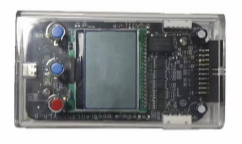
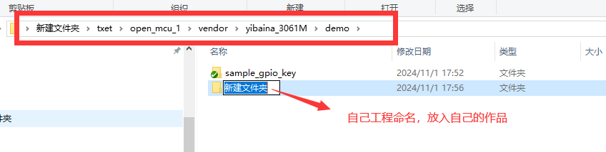
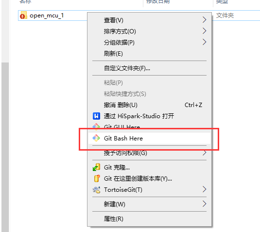
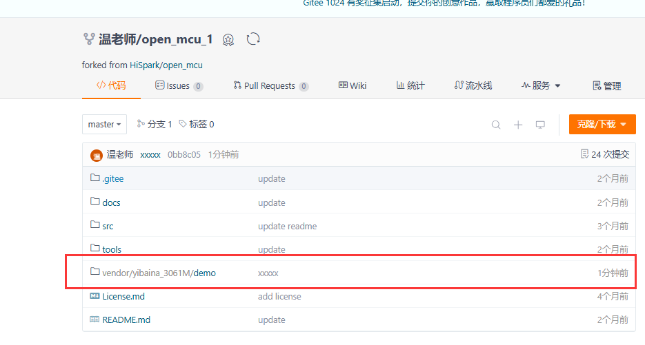
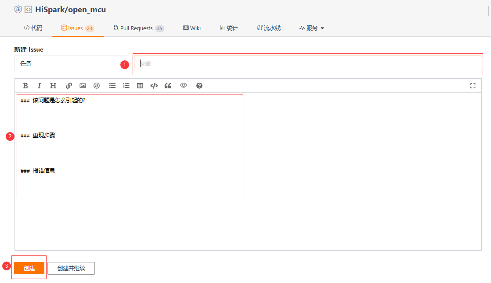
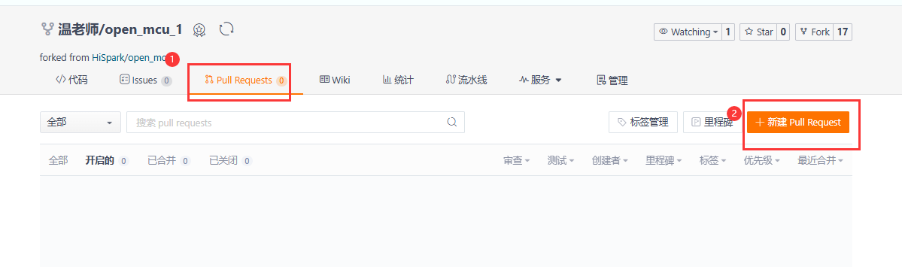
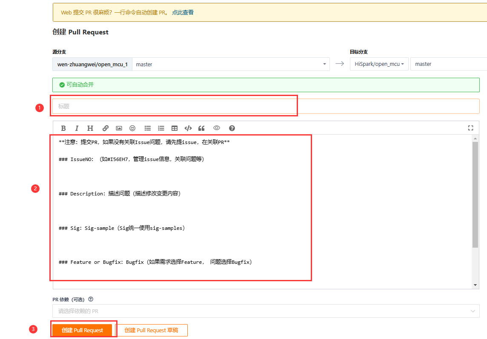

# open_mcu开发指南

## 介绍

  open_mcu代码仓为支持3061M、3065H、3066M解决方案SDK，该SDK支持HiSparkStudio1.0.0.10及以上版本

## 购买渠道

|      名称      | 批量购买                                                     | 少量购买                                                     | 介绍                            |
| :------------: | ------------------------------------------------------------ | ------------------------------------------------------------ | ------------------------------- |
| V5A20002NOQJDB | [购买链接](https://search.ickey.cn/?keyword=V5A20002NOQJDB&bom_ab=null) | 暂无                                                         | 3061M系列解决方案  128KB QFP48  |
| V5A20002NOOJLB | [购买链接](https://www.ickey.cn/detail/1003001016603886/V5A20002NOOJLB.html#208f8e9e-5cdf-4353-988d-d1df20bbb33f) | [购买链接](https://www.ickey.cn/detail/1003001021937018/V5A20002NOOJLB.html#a48f53a5-b3cf-4d3e-8254-e91505f16fae) | 3061M系列解决方案  128KB QFN32  |
| V5A20002NOQJLB | [购买链接](https://www.ickey.cn/detail/1003001016603885/V5A20002NOQJLB.html#208f8e9e-5cdf-4353-988d-d1df20bbb33f) | [购买链接](https://www.ickey.cn/detail/1003001017510002/V5A20002NOQJLB.html#a48f53a5-b3cf-4d3e-8254-e91505f16fae) | 3061M系列解决方案  128KB QFP32  |
| V5A20002NOOJDB | [购买链接](https://www.ickey.cn/detail/1003001016603884/V5A20002NOOJDB.html#208f8e9e-5cdf-4353-988d-d1df20bbb33f) | 暂无                                                         | 3061M系列解决方案  128KB QFN48  |
| V5A20002NOOJD9 | [购买链接](https://www.ickey.cn/detail/1003001016603888/V5A20002NOOJD9.html#d9fd2c53-3b07-4b62-ba26-cb59ae94234f) | [购买链接](https://www.ickey.cn/detail/1003001021937055/V5A20002NOOJD9.html#a48f53a5-b3cf-4d3e-8254-e91505f16fae) | 3061M系列解决方案   64KB QFN48  |
| V5A20002NOQJD9 | [购买链接](https://www.ickey.cn/detail/1003001016603887/V5A20002NOQJD9.html#208f8e9e-5cdf-4353-988d-d1df20bbb33f) | 暂无                                                         | 3061M系列解决方案   64KB QFP48  |
| V5A20002NOQJL9 | [购买链接](https://www.ickey.cn/detail/1003001016603889/V5A20002NOQJL9.html#208f8e9e-5cdf-4353-988d-d1df20bbb33f) | [购买链接](https://www.ickey.cn/detail/1003001021936978/V5A20002NOQJL9.html#a48f53a5-b3cf-4d3e-8254-e91505f16fae) | 3061M系列解决方案   64KB QFP32  |
| V5A20002NOOJL9 | [购买链接](https://www.ickey.cn/detail/1003001016603890/V5A20002NOOJL9.html#208f8e9e-5cdf-4353-988d-d1df20bbb33f) | [购买链接](https://www.ickey.cn/detail/1003001021936989/V5A20002NOOJL9.html#a48f53a5-b3cf-4d3e-8254-e91505f16fae) | 3061M系列解决方案   64KB QFN32  |
| V5A20001ISQJSA | [购买链接](https://www.ickey.cn/detail/1003001016603882/V5A20001ISQJSA.html#) | 暂无                                                         | 3065H系列解决方案  160KB LQFP64 |


  

## 支持的开发板

|                 开发板名称                 | 硬件资料                                                     | 软件资料     | 购买链接                                                     | 开发板介绍                                                   |
| :----------------------------------------: | ------------------------------------------------------------ | :----------- | :----------------------------------------------------------- | :----------------------------------------------------------- |
| ECBMCU201MPC | [开发板硬件原理图](https://gitee.com/HiSpark/open_mcu/tree/master/docs/hardware/3061M) | 参考示例教程 | [开发板购买链接](https://m.tb.cn/h.gMEbHlepTLs5DNB?tk=aKIe356U3bY) | 3061M是针对家电、工业等领域设计的高性价比MCU，使用RISC-V内核，支持150MHz主频，支持AI场景扩展；支持32KB SRAM和128KB 内置Flash，可支持客户产品功能持续迭代和算法升级；可应用于冰洗空、电动自行车、高速风机、电动工具、按摩椅等比较广泛的应用场景。 |
|  ECBMCU105H  | [开发板硬件原理图](https://gitee.com/HiSpark/open_mcu/tree/master/docs/hardware/3065H) | 参考示例教程 | [开发板购买链接](https://m.tb.cn/h.gMEbHlepTLs5DNB?tk=aKIe356U3bY) | 3065H是RISC-V内核的高性能实时控制专用MCU， 具有高性能、高集成度、高可靠性、易开发的特点，同时配合强大的算法团队和嵌入式AI能力，使得3065H上市后快速获得家电、能源、工业等行业内多个客户的认可和好评。 |
## 支持的调试器

|                          调试器名称                          | 使用说明                                                     | 购买链接                                                     | 调试器介绍                                                   |
| :----------------------------------------------------------: | ------------------------------------------------------------ | ------------------------------------------------------------ | ------------------------------------------------------------ |
| Hispark-Trace<br /> | [HiSpark调试器系列 使用指南](https://gitee.com/HiSpark/open_mcu/tree/master/tools) | [调试器购买链接](https://e.tb.cn/h.T8tE2Ot1oR359nj?tk=Fy3He1qiATn) | 高级变量实时跟踪调试器，配合Variable Trace 实时变量监控工具使用 |

## 配套电机

|                           电机名称                           | 购买链接                                                     | 电机介绍                                                |
| :----------------------------------------------------------: | ------------------------------------------------------------ | ------------------------------------------------------- |
| GBM2804H-100T<br /> | [电机购买链接]( https://e.tb.cn/h.Ty09arIVIwTIzB9?tk=Syv4eMwMVb5 ) | 翼飞 iPower GBM2804H-100T 狗三无刷云台电机 手持云台电机 |

## 配套电源

|                           电源名称                           | 购买链接                                                     | 电源介绍                                                     |
| :----------------------------------------------------------: | ------------------------------------------------------------ | ------------------------------------------------------------ |
| HUAWEI HW-120200C1W<br /> | [电源购买链接](https://e.tb.cn/h.Tyd5ScSTaHsRNDO?tk=bTFoeMwOr5N  ) | output/输出：12V -2A   input/输入：180-240V 深圳航嘉池源电源适配器 |

## 快速上手

SDK包目录：[参考src/README.md](https://gitee.com/HiSpark/open_mcu/tree/master/src)

环境搭建：[参考tools目录README搭建环境](https://gitee.com/HiSpark/open_mcu/tree/master/tools)

手册资料：[参考src/document](https://gitee.com/HiSpark/open_mcu/tree/master/src/document)

实验指导：[参考3061M实验指导手册](https://gitee.com/HiSpark/open_mcu/tree/master/docs)

## 示例教程

ECBMCU201MPC、ECBMCU105H、ECBMCU301M提供了以下Demo供开发参考：

<table  width="990" border="0" cellpadding="0" cellspacing="0" style='border-collapse:collapse;table-layout:fixed;'>
 <tr height="18" style='height:13.50pt;'>
  <td width="140" x:str><strong>一级分类</strong></td>
  <td width="170" x:str><strong>子分类</strong></td>
  <td width="680" colspan="6" align="center" x:str><strong>应用示例</strong></td>
 </tr>
 <tr height="18" style='height:13.50pt;'>
  <td width="140" align="center" rowspan="3" style='height:27.00pt' x:str>
<strong>系统核心模块</strong></td>
  <td x:str><strong>GPIO</strong></td>
  <td width="170" x:str><a href="https://gitee.com/HiSpark/open_mcu/tree/master/src/application/drivers_sample/gpio/sample_gpio_led">GPIO管脚控制LED灯的亮灭端案例</a></td>
  <td width="170" x:str><a href="https://gitee.com/HiSpark/open_mcu/tree/master/src/application/drivers_sample/gpio/sample_gpio_key">GPIO对按键检测案例</a></td>
  <td width="170" x:str><a href="https://gitee.com/HiSpark/open_mcu/tree/master/src/application/drivers_sample/gpio/sample_gpio_interrupt">GPIO中断功能测试案例”</a></td>
  <td width="170" x:str><a href="https://gitee.com/HiSpark/open_mcu/tree/master/src/application/drivers_sample/gpio/sample_gpio_circle">GPIO两个管脚的环回测试</a></td>
  <td width="170" x:str><a href=""></a></td>
  <td width="170" x:str><a href=""></a></td>
 </tr>
 <tr height="18" style='height:13.50pt;'>
  <td x:str><strong>WDG</strong></td>
  <td x:str><a href="https://gitee.com/HiSpark/open_mcu/tree/master/src/application/drivers_sample/wdg/sample_iwdg_refresh">独立看门狗测试案例</a></td>
  <td x:str><a href="https://gitee.com/HiSpark/open_mcu/tree/master/src/application/drivers_sample/wdg/sample_wwdg_refresh">窗口看门狗测试案例</a></td>
  <td width="170" x:str><a href=""></a></td>
  <td ></td>
  <td ></td>
  <td ></td>
 </tr>
 <tr height="18" style='height:13.50pt;'>
  <td x:str><strong>PMC</strong></td>
  <td x:str><a href="https://gitee.com/HiSpark/open_mcu/tree/master/src/application/drivers_sample/pmc/sample_pmc_wakeup">PMC模块的定时唤醒案例</a></td>
  <td ></td>
  <td ></td>
  <td ></td>
  <td ></td>
  <td ></td>
 </tr>
  <tr height="18" style='height:13.50pt;'>
  <td width="140" align="center" rowspan="3" style='height:27.00pt' x:str>
<strong>模拟模块</strong></td>
  <td x:str><strong>ACMP_DAC</strong></td>
  <td width="170" x:str><a href="https://gitee.com/HiSpark/open_mcu/tree/master/src/application/drivers_sample/acmp/sample_acmp_interrupt">模拟比较器中断使用案例</a></td>
  <td width="170" x:str><a                       href="https://gitee.com/HiSpark/open_mcu/tree/master/src/application/drivers_sample/acmp/sample_acmp_out_result">模拟比较器与DAC基本使用案例</a></td>
  <td width="170" x:str><a href=""></a></td>
  <td ></td>
  <td ></td>
  <td ></td>
 </tr>
 <tr height="18" style='height:13.50pt;'>
  <td x:str><strong>ADC</strong></td>
  <td x:str><a href="https://gitee.com/HiSpark/open_mcu/tree/master/src/application/drivers_sample/adc/sample_adc_single_trigger_it">ADC的单次采样案例</a></td>
  <td width="170" x:str><a 
href="https://gitee.com/HiSpark/open_mcu/tree/master/src/application/drivers_sample/adc/sample_adc_continue_trigger">单次触发ADC实现连续采样案例</a></td>
  <td width="170" x:str><a href=""></a></td>
  <td ></td>
  <td ></td>
  <td ></td>
 </tr>
  <tr height="18" style='height:13.50pt;'>
  <td x:str><strong>PGA</strong></td>
  <td x:str><a href="https://gitee.com/HiSpark/open_mcu/tree/master/src/application/drivers_sample/pga/sample_pga_result_sampling">ADC采样PGA的输出电压案例</a></td>
  <td width="170" x:str><a href=""></a></td>
  <td width="170" x:str><a href=""></a></td>
  <td ></td>
  <td ></td>
  <td ></td>
 </tr>
  <tr height="18" style='height:13.50pt;'>
  <td width="140" align="center" rowspan="7" style='height:27.00pt' x:str>
<strong>定时器/事件模块</strong></td>
  <td x:str><strong>GPT</strong></td> 
   <td width="170" x:str><a  href="https://gitee.com/HiSpark/open_mcu/tree/master/src/application/drivers_sample/gpt/sample_gpt_pwm_output">PWM波使用案例</a></td>
  <td width="170" x:str><a 
  <td ></td>
  <td ></td>
  <td ></td>
  <td ></td>
  <td ></td>
 </tr>
  <tr height="18" style='height:13.50pt;'>
  <td x:str><strong>APT</strong></td>
  <td width="170" x:str><a 
href="https://gitee.com/HiSpark/open_mcu/tree/master/src/application/drivers_sample/apt/sample_apt_single_resistor">高级定时器输出三相互补PWM波案例</a></td>
  <td width="170" x:str><a href="https://gitee.com/HiSpark/open_mcu/tree/master/src/application/drivers_sample/adc/sample_adc_associative_trigger_of_apt">使用APT对ADC进行周期采样案例</a></td>
  <td width="170" x:str><a href=""></a></td>
  <td ></td>
  <td ></td>
  <td ></td>
 </tr>
 <tr height="18" style='height:13.50pt;'>
  <td x:str><strong>TIMER</strong></td>
  <td width="170" x:str><a href="https://gitee.com/HiSpark/open_mcu/tree/master/src/application/drivers_sample/timer/sample_timer_interrupt">定时器中断使用案例 </td>
  <td width="170" x:str><a 
  <td ></td>
  <td ></td>
  <td ></td>
  <td ></td>
  <td ></td>
 </tr>
  <tr height="18" style='height:13.50pt;'>
  <td x:str><strong>CFD</strong></td>
  <td width="170" x:str><a href="https://gitee.com/HiSpark/open_mcu/tree/master/src/application/drivers_sample/cfd/sample_cfd_check_error">CFD的时钟失效保护使用案例
  <td ></td>
  <td ></td>
  <td ></td>
  <td ></td>
  <td ></td> 
 </tr>
 <tr height="18" style='height:13.50pt;'>
  <td x:str><strong>CMM</strong></td>
  <td width="170" x:str><a href="https://gitee.com/HiSpark/open_mcu/tree/master/src/application/drivers_sample/cmm/sample_cmm_check_error">CMM时钟频率监测和频率中断的使用案例 </td>
  <td width="170" x:str><a 
  <td ></td>
  <td ></td>
  <td ></td>
  <td ></td>
  <td ></td>
 </tr>
 </tr>
 <tr height="18" style='height:13.50pt;'>
  <td x:str><strong>QDM</strong></td>
  <td width="170" x:str><a href="https://gitee.com/HiSpark/open_mcu/tree/master/src/application/drivers_sample/qdm/sample_qdm_m">M法测量电机实时转速使用案例 </td>
  <td width="170" x:str><a 
  href="https://gitee.com/HiSpark/open_mcu/tree/master/src/application/middleware_sample/pmsm_encode_qdm_2shunt_foc">单电机双电阻采样的有感Foc应用案例 </td>
  <td ></td>
  <td ></td>
  <td ></td>
  <td ></td>
 </tr>
 <tr height="18" style='height:13.50pt;'>
  <td x:str><strong>CAPM</strong></td>
  <td x:str><a href="https://gitee.com/HiSpark/open_mcu/tree/master/src/application/drivers_sample/capm/capm_hall_sample">CAPM读取电机HALL位置传感器案例</a></td>
  <td width="170" x:str><a href=""></a></td>
  <td width="170" x:str><a href=""></a></td>
  <td ></td>
  <td ></td>
  <td ></td>
 </tr>
 <tr height="18" style='height:13.50pt;'>
  <td width="140" align="center" rowspan="4" style='height:27.00pt' x:str>
<strong>通信模块</strong></td>
  <td x:str><strong>UART</strong></td> 
  <td x:str><a href="https://gitee.com/HiSpark/open_mcu/tree/master/src/application/drivers_sample/uart/sample_uart_interrupt_tx_after_rx">中断模式下环回发送数据案例</a></td>
  <td width="170" x:str><a href="https://gitee.com/HiSpark/open_mcu/tree/master/src/application/drivers_sample/uart/sample_uart_dma_tx_int_rx_simultaneously">Tx_DMA_Rx_INT收发数据案例</a></td>
  <td width="170" x:str><a href="https://gitee.com/HiSpark/open_mcu/tree/master/src/application/drivers_sample/uart/sample_uart_character_match">UART检测特定字符案例</a></td>
  <td ></td>
  <td ></td>
  <td ></td>
 </tr>
<tr height="18" style='height:13.50pt;'>
  <td x:str><strong>IIC</strong></td>
  <td x:str><a href="https://gitee.com/HiSpark/open_mcu/tree/master/src/application/drivers_sample/i2c/sample_i2c_master_blocking_at24c64">用IIC通信AT24C64使用案例</a></td>
  <td width="170" x:str><a href=""></a></td>
  <td width="170" x:str><a href=""></a></td>
  <td ></td>
  <td ></td>
  <td ></td>
 </tr>
<tr height="18" style='height:13.50pt;'>
  <td x:str><strong>SPI</strong></td>
  <td x:str><a href="https://gitee.com/HiSpark/open_mcu/tree/master/src/application/drivers_sample/spi/sample_spi_master">两开发板通信主机使用案例</a></td>
  <td width="170" x:str><a href="https://gitee.com/HiSpark/open_mcu/tree/master/src/application/drivers_sample/spi/sample_spi_slave">两开发板通信从机使用案例</a></td>
  <td width="170" x:str><a href=""></a></td>
  <td ></td>
  <td ></td>
  <td ></td>
 </tr>
<tr height="18" style='height:13.50pt;'>
  <td x:str><strong>CAN</strong></td>
  <td x:str><a href="https://gitee.com/HiSpark/open_mcu/tree/master/src/application/drivers_sample/can/sample_can_send_receive">CAN总线使用案例</a></td>
<td width="170" x:str><a href=""></a></td>
  <td width="170" x:str><a href=""></a></td>
  <td ></td>
  <td ></td>
  <td ></td>
 </tr>
 </tr>
<tr height="18" style='height:13.50pt;'>
  <td width="140" align="center" rowspan="1" style='height:27.00pt' x:str>
<strong>计算模块</strong></td>
  <td x:str><strong>CRC</strong></td> 
  <td x:str><a href="https://gitee.com/HiSpark/open_mcu/tree/master/src/application/drivers_sample/crc/sample_crc_gen_algo">CRC16_XMODEM算法使用案例</a></td>
  <td ></td>
  <td ></td>
  <td ></td>
  <td ></td>
  <td ></td>
 </tr>
<![if supportMisalignedColumns]>
   <tr height="18" style="display:none;">
   </tr>
  <![endif]>
</table>

## 目录介绍

| 目录   | 介绍                         |
| ------ | ---------------------------- |
| docs   | 存放硬件原理图、实验指导手册 |
| src    | SDK源码目录                  |
| tools  | 开发工具及环境搭建指南       |
| vendor | 存放对应开发板案例           |

## 硬件介绍

### 3061M介绍

3061M系列 生态板由 ECBMCU201MPC（核心板）和 ECBMOTORA（电机驱动板组成）。

ECBMCU201MPC是针对 3061M系列 MCU开发的生态核心板，用于 3061M初始评估和设计参考，内嵌一块 USB接口的调试板。

ECBMOTORA是电机驱动扩展板，支持一个 BLDC或 PMSM电机控制。该单板支持24V/12V DCIN输入。

核心板电机驱动扩展板的常用组装方式是电机驱动板通过两个40pin连接器扣接到核心板，如下图所示。


### 3061M硬件说明

 3061M通用生态板通过 ECBMCU201MPC核心板实现控制、 ECBMOTORA 扩展板实现接口扩展以及电源接口，同时提供USB TypeC线进行调试 / 供电、12V电源适配器和一个电机。


3061M通用生态板用户手册详细内容请查阅：<a href="https://gitee.com/HiSpark/open_mcu/tree/master/src/document/hardware/3061M" title="超链接title">3061M系列 通用生态板用户手册 00B01</a>

### 3065H介绍

3065H 通用生态板由 ECBMCU105H （核心板）和 ECBMOTORA （电机驱动板）组成。

ECBMCU105H是针对 3065H 生态核心板，用于 3065H 初始评估和设计参考，内嵌一块 USB 接口的调试板。

ECBMOTORA是电机驱动扩展板，支持一个 BLDC 或 PMSM 电机控制。该单板支持24V/12V DCIN 输入。

核心板电机驱动扩展板的常用组装方式是电机驱动板通过两个40pin 连接器扣接到核心板，如下图所示。


### 3065H硬件说明

 3065H通用生态板通过ECBMCU105H 核心板实现控制、 ECBMOTORA 扩展板实现接口扩展以及电源接口，同时提供USB TypeC线进行调试 / 供电、12V电源适配器和一个电机。

  

3065H通用生态板用户手册详细内容请查阅：<a href="https://gitee.com/HiSpark/open_mcu/tree/master/src/document/hardware/306xH" title="超链接title">3065H通用生态板用户手册 V03</a>

### 3066M介绍

3065H 通用生态板由 ECBMCU301M （核心板）和 ECBMOTORA （电机驱动板）组成。

ECBMCU301M是针对 3066M 生态核心板，用于 3066M 初始评估和设计参考，内嵌一块 USB 接口的调试板。

ECBMOTORA是电机驱动扩展板，支持一个 BLDC 或 PMSM 电机控制。该单板支持24V/12V DCIN 输入。

核心板电机驱动扩展板的常用组装方式是电机驱动板通过两个40pin 连接器扣接到核心板，如下图所示。


### 3066M硬件说明

 3066M通用生态板通过ECBMCU301M 核心板实现控制、 ECBMOTORA 扩展板实现接口扩展以及电源接口，同时提供USB TypeC线进行调试 / 供电、12V电源适配器和一个电机。

  

3066M通用生态板用户手册详细内容请查阅：<a href="https://gitee.com/HiSpark/open_mcu/tree/master/src/document/hardware/3066M%EF%BC%8F3065P" title="超链接title">3066M通用生态板用户手册 V00B01</a>


## 开发环境搭建

[参考tools目录README搭建环境](https://gitee.com/HiSpark/open_mcu/tree/master/tools)

## Demo

3061M/3065H/3066M提供了以下Demo供开发参考，sample存放路径：[application_sample](https://gitee.com/HiSpark/open_mcu/tree/master/src/application)

**主目录结构说明**

| 文件夹名          | 描述           |
| ----------------- | -------------- |
| board\_sample     | 开发板示例。   |
| drivers_sample    | 驱动程序示例。 |
| middleware_sample | 中间件示例。   |
| user              | 用户相关。     |

**表 1  board\_sample目录结构说明**

| **文件夹名** | **描述**                   |
| ------------ | -------------------------- |
| dimming      | 呼吸灯功能示例。           |
| key          | 按键检查功能示例。         |
| led          | 数码管功能示例。           |
| pulses       | gpio发送pwm波功能示例。    |
| softserial   | gpio实现串口通信功能示例。 |

**表 2  acmp目录结构说明**

| **文件夹名** | **描述**         |
| ------------ | ---------------- |
| sample_acmp  | 比较器使用示例。 |

**表 3  adc目录结构说明**

| **文件夹名**                          | **描述**            |
| ------------------------------------- | ------------------- |
| sample_adc_associative_trigger_of_apt | APT触发ADC。        |
| sample_adc_continue_trigger           | ADC连续采样。       |
| sample_adc_over_sample                | ADC过采样。         |
| sample_adc_single_trigger             | ADC单次采样。       |
| sample_adc_single_trigger_dma         | ADC单次采样带DMA。  |
| sample_adc_single_trigger_it          | ADC单次采样带中断。 |
| sample_adc_sync_sample                | ADC同步采样。       |
| sample_adc_sync_sample_dma            | ADC同步采样带DMA。  |
| sample_adc_sync_sample_it             | ADC同步采样带中断。 |

**表 4  apt目录结构说明**

| **文件夹名**               | **描述**                                          |
| -------------------------- | ------------------------------------------------- |
| sample_apt_single_resistor | APT单电阻采样示例，仅在U相触发ADC采样信号。       |
| sample_apt_three_resistor  | APT三电阻采样示例，在U、V和W相都触发ADC采样信号。 |

**表 5  can目录结构说明**

| **文件夹名**            | **描述**                |
| ----------------------- | ----------------------- |
| sample_can_send_receive | CAN发送和接收数据示例。 |

**表 6  capm目录结构说明**

| **文件夹名**     | **描述**                   |
| ---------------- | -------------------------- |
| capm_hall_sample | CAPM读取霍尔传感器值示例。 |

**表 7  cfd目录结构说明**

| **文件夹名**           | **描述**                              |
| ---------------------- | ------------------------------------- |
| sample_cfd_check_error | cfd注入错误前后监测目标时钟异常功能。 |

**表 8  cmm目录结构说明**

| **文件夹名**           | **描述**                              |
| ---------------------- | ------------------------------------- |
| sample_cmm_check_error | cmm注入错误前后监测目标时钟异常功能。 |

**表 9  crc目录结构说明**

| **文件夹名**     | **描述**                                                 |
| ---------------- | -------------------------------------------------------- |
| sample_crc_check | 测试CRC不同算法和输入有效位宽，生成并校验crc值。         |
| sample_crc_gen   | 计算并生成CRC数值。                                      |
| sample_crc_load  | 通过load初始值将xmodem算法改为ccit-false算法并校验结果。 |

**表 10  dac目录结构说明**

| **文件夹名** | **描述**                |
| ------------ | ----------------------- |
| sample_dac   | DAC电压输出到管脚示例。 |

**表 11  dma目录结构说明**

| **文件夹名**                      | **描述**                  |
| --------------------------------- | ------------------------- |
| sample_dma_list_transfer          | DMA链式传输。             |
| sample_dma_list_transfer_continue | DMA链式传输实现连续功能。 |
| sample_dma_mem_to_mem             | DMA内存到内存传输。       |
| sample_dma_mem_to_per             | DMA内存到外设传输。       |
| sample_dma_per_to_mem             | DMA外设到内存传输。       |
| sample_dma_per_to_per             | DMA外设到外设传输。       |

**表 12  flash目录结构说明**

| **文件夹名**           | **描述**            |
| ---------------------- | ------------------- |
| sample_flash_blocking  | 阻塞模式操作flash。 |
| sample_flash_interrupt | 中断方式操作flash。 |

**表 13  gpio目录结构说明**

| **文件夹名**          | **描述**                     |
| --------------------- | ---------------------------- |
| sample_gpio_circle    | GPIO环回测试电平和方向属性。 |
| sample_gpio_interrupt | 测试GPIO不同中断类型。       |
| sample_gpio_key       | GPIO用作按键功能。           |
| sample_gpio_led       | GPIO周期控制led亮灭功能。    |

**表 14  gpt目录结构说明**

| **文件夹名**         | **描述**         |
| -------------------- | ---------------- |
| sample_gpt_simplerun | gpt产生PWM波形。 |

**表 15  i2c目录结构说明**

| **文件夹名**                | **描述**                       |
| --------------------------- | ------------------------------ |
| sample_i2c_blocking_stlm75  | 使用阻塞的方式读写温度传感器。 |
| sample_i2c_interrupt_stlm75 | 使用中断的方式读写温度传感器。 |
| sample_i2c_dma_stlm75       | 使用dma方式读写温度传感器。    |

**表 16  iocmg目录结构说明**

| **文件夹名**  | **描述**                            |
| ------------- | ----------------------------------- |
| iolist_sample | iocmg初始化管脚列表的属性配置功能。 |

**表 17  pga目录结构说明**

| **文件夹名**              | **描述**              |
| ------------------------- | --------------------- |
| sample_pga                | PGA内部电阻放大示例。 |
| sample_pga_extra_resistor | PGA外部电阻放大示例。 |

**表 18  pmc目录结构说明**

| **文件夹名**      | **描述**            |
| ----------------- | ------------------- |
| sample_pmc_pvd    | PMC掉电检测示例。   |
| sample_pmc_wakeup | PMC定时器唤醒示例。 |

**表 19  qdm目录结构说明**

| **文件夹名**  | **描述**                        |
| ------------- | ------------------------------- |
| sample_qdm_m  | QDM使用M法读取电机转速的示例。  |
| sample_qdm_mt | QDM使用MT法读取电机转速的示例。 |

**表 20  spi目录机构说明**

| **文件夹名**                 | **描述**                          |
| ---------------------------- | --------------------------------- |
| sample_spi_blocking_kta7953  | 使用阻塞方式读写ADC。             |
| sample_spi_dma_kta7953       | 使用dma方式读写ADC。              |
| sample_spi_interrupt_kta7953 | 使用中断方式读写ADC。             |
| sample_spi_microwire_master  | 演示如何使用microwire master。    |
| sample_spi_microwire_slave   | 演示如何使用microwire slave。     |
| sample_spi_slave             | 演示如何使用motorola spi slaver。 |

**表 21  timer目录结构说明**

| **文件夹名**           | **描述**                              |
| ---------------------- | ------------------------------------- |
| sample_timer_interrupt | timer定时触发中断，执行用户串口打印。 |

**表 22  tsensor目录结构说明**

| **文件夹名**   | **描述**                |
| -------------- | ----------------------- |
| sample_tsensor | tsensor对器件结温采样。 |

**表 23  uart目录结构说明**

| **文件夹名**                             | **描述**                                   |
| ---------------------------------------- | ------------------------------------------ |
| sample_uart_blocking_rx                  | UART阻塞接收。                             |
| sample_uart_blocking_tx                  | UART阻塞发送。                             |
| sample_uart_dma_rx                       | UART带DMA接收。                            |
| sample_uart_dma_tx                       | UART带DMA发送。                            |
| sample_uart_interrupt_tx_after_rx        | UART中断接收数据之后，再中断发送此数据。   |
| sample_uart_interrupt_rx                 | UART中断接收。                             |
| sample_uart_interrupt_tx                 | UART中断发送。                             |
| sample_uart_dma_tx_dma_rx_simultaneously | UART全双工模式，DMA同时发送和接收。        |
| sample_uart_dma_tx_int_rx_simultaneously | UART全双工模式，DMA发送的同时，中断接收。  |
| sample_uart_int_tx_dma_rx_simultaneously | UART全双工模式，中断发送的同时，DMA接收。  |
| sample_uart_int_tx_int_rx_simultaneously | UART全双工模式，中断发送的同时，中断接收。 |
| sample_uart_dma_rx_cyclically_stored     | UART使用DMA循环搬运数据到指定内存。        |
| sample_uart_single_wire_communication    | UART单线通信示例。                         |

**表 24  wdg目录机构说明**

| **文件夹名**      | **描述**                 |
| ----------------- | ------------------------ |
| sample_wdg_reset  | 测试wdg不喂狗复位功能。  |
| sample_iwdg_reset | 测试iwdg不喂狗复位功能。 |

**表 25  middleware\_sample目录机构说明**

| **文件夹名**               | **描述**                                |
| -------------------------- | --------------------------------------- |
| mcs_65ldemo                | 电机控制算法在AD101HDMA_VER.B板的示例。 |
| mcs_65demo                 | 电机控制算法在AD105HDMA_VER.B板的示例。 |
| pmsm_sensorless_1shunt_foc | 永磁同步电机单电阻采样无感FOC应用。     |
| pmsm_sensorless_2shunt_foc | 永磁同步电机双电阻采样无感FOC应用。     |

## **问题与解答**

如果你对项目中的代码或者文档存在疑问, 欢迎在Issues中提出你的问题(别忘了先在FAQ中看一看是否已经有答案了😎). 如果你自己解决了一个了不起的问题, 非常欢迎你把问题和解决方法发到Issues里, 如果你看到别人的问题而你正好有答案, 也欢迎你帮助解答其他人的问题, 所谓"授人玫瑰手有余香"嘛。

## **参与贡献**

- 在windows/linux下安装git，并配置git账号、密码、邮箱等

  git config --global user.name "Your Name" // 配置用户名

  git config --global user.email "your.email@example.com" // 配置邮箱

  git config –local user.password “xxxxx密码”  // 配置密码

  git config –list    // 查看配置信息

- fork仓库，就是把官方仓库当前时间点内容搬迁到自己账号下面，直接在网页上操作即可完成。如我们活动仓库Fork到自己账号下面。

  

  

- 将个人仓库克隆到本地仓库，在windows/linux下打开git，点击网页上的“克隆/下载”，在本地文件夹中鼠标“右键”，选择"Open Git Bash here"，在打开的bash窗口，执行复制的指令

  

  

  ```
  git clone https://gitee.com/xxx/open_mcu.git   // xxx代表gitee账号
  ```

  

  - 克隆完成后，在本地vendor目录下创建others/demo/xxxx(demo名称)文件夹，并将demo使用指南、代码提交到代码仓中，如下

    

  - 修改完成后，在本地仓库上传修改后的内容，依次执行以下命令。

    

    

  - 上传完成后可以看见自己gitee仓库文件已经更新。

    

  - [创建ISSUE](https://gitee.com/HiSpark/open_mcu/issues) 根据提示填写对应信息。

    

    

  - 访问您在码云上的fork仓页面，点击创建Pull Request按钮选择对应分支生成PR，详细操作请参考码云帮助中心的开发协作指导：https://gitee.com/help/articles/4128
  
    
  
    

## **最后的话**

Hispark Studio是一款年轻且处于快速发展的IDE。在使用过程中，你可能会碰到一些棘手的问题，但别担心，你可以尝试多种方法去解决，比如用搜索引擎寻找答案，或者向社区寻求帮助。记住，所有技术大神都是从解决这些问题中成长起来的。我们和其他开发者也会尽力提供帮助。

最后的最后, 欢迎来到Hispark Studio的世界探险!