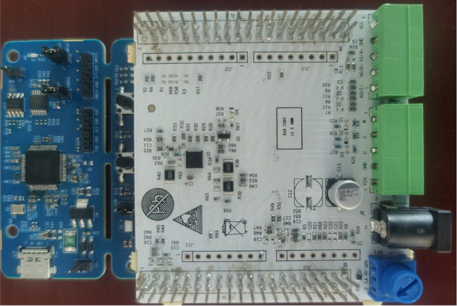
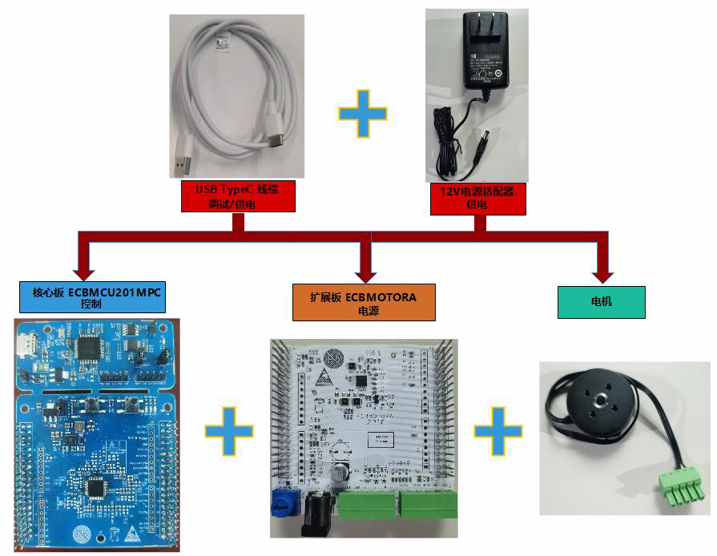
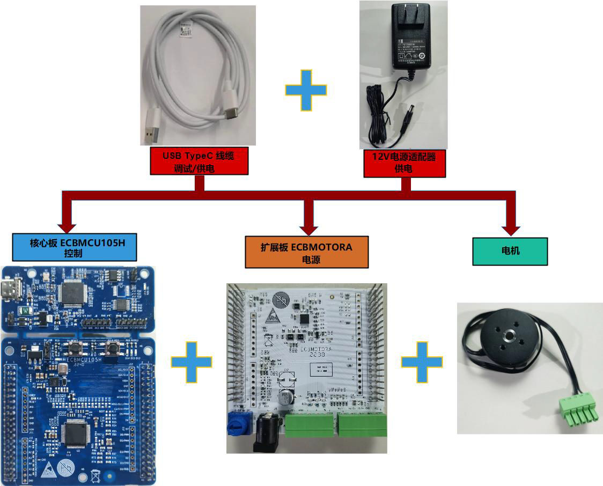
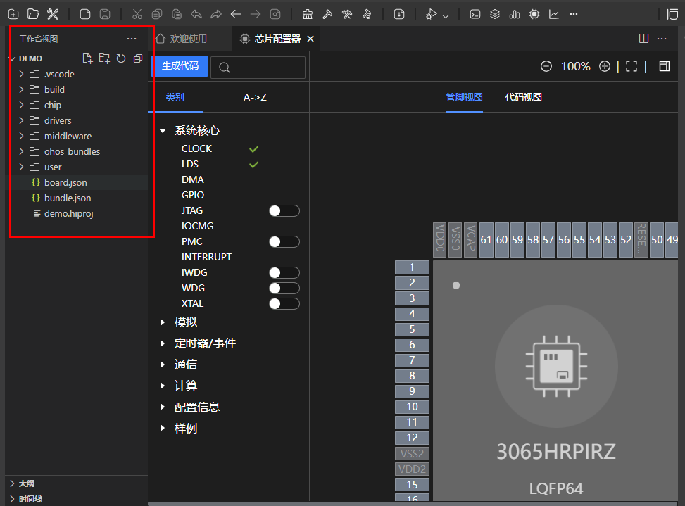
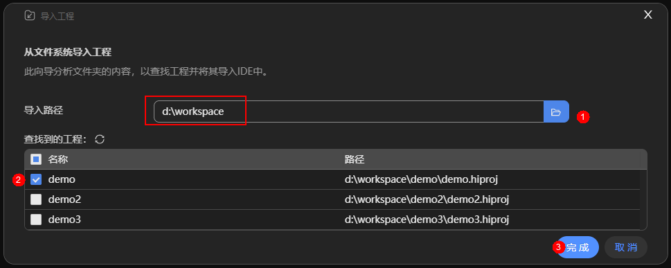
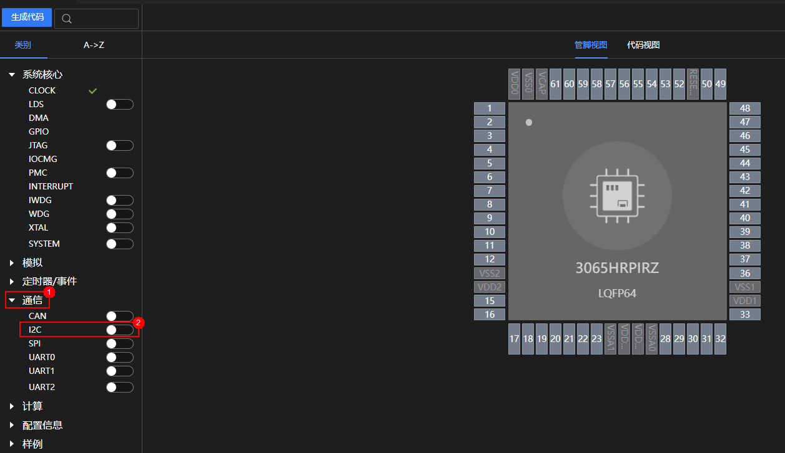
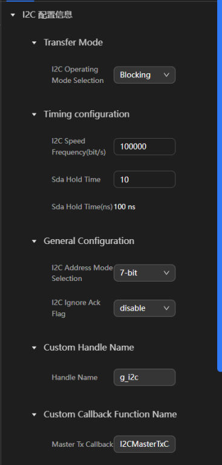
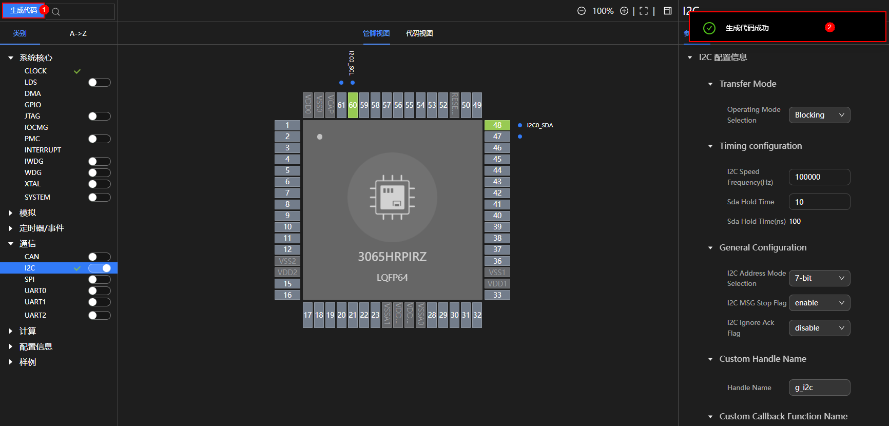
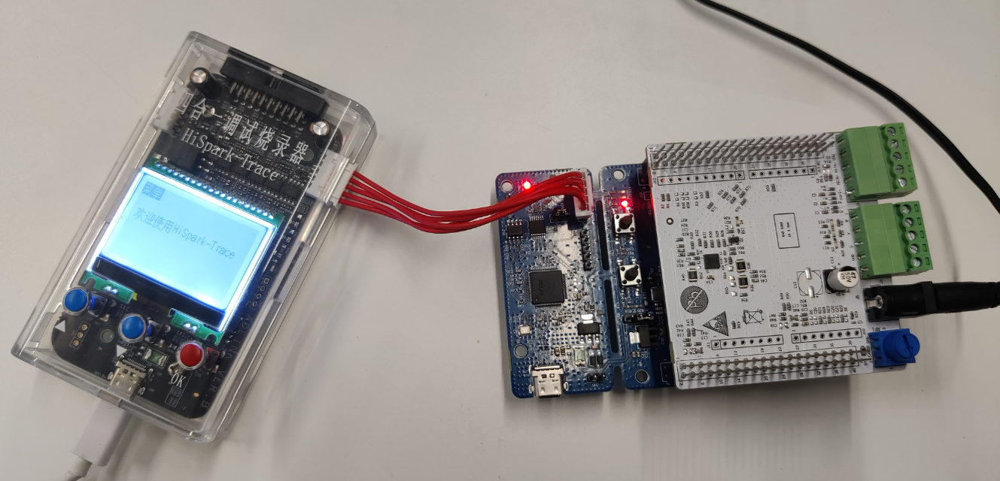

# 3061M/3065H通用生态板嵌入式应用

## 3061M介绍

3061M系列 生态板由 ECBMCU201MPC（核心板）和 ECBMOTORA（电机驱动板组成。

ECBMCU201MPC是针对 3061M系列 MCU开发的生态核心板，用于 3061M初始评估和设计参考，内嵌一块 USB接口的调试板。

ECBMOTORA是电机驱动扩展板，支持一个 BLDC或 PMSM电机控制。该单板支持24V/12V DCIN输入。

核心板电机驱动扩展板的常用组装方式是电机驱动板通过两个40pin连接器扣接到核心板，如下图所示。

### 3061M硬件说明

 3061M通用生态板通过 ECBMCU201MPC核心板实现控制、 ECBMOTORA 扩展板实现接口扩展以及电源接口，同时提供USB TypeC线进行调试 / 供电、12V电源适配器和一个电机。

3061M通用生态板用户手册详细内容请查阅：https://gitee.com/HiSpark/open_mcu/tree/master/src/document/hardware/2.%203061/1.%203061%20%E7%94%9F%E6%80%81%E6%9D%BF%E5%8F%82%E8%80%83%E8%AE%BE%E8%AE%A1

## 3065H介绍

3065H 通用生态板由 ECBMCU105H （核心板）和 ECBMOTORA （电机驱动板）组成。

ECBMCU105H是针对 3065H 芯片开发的生态核心板，用于 3065H 芯片初始评估和设计参考，内嵌一块 USB 接口的调试板。

ECBMOTORA是电机驱动扩展板，支持一个 BLDC 或 PMSM 电机控制。该单板支持24V/12V DCIN 输入。

核心板电机驱动扩展板的常用组装方式是电机驱动板通过两个40pin 连接器扣接到核心板，如下图所示。

### 3065H硬件说明

 3065H通用生态板通过ECBMCU105H 核心板实现控制、 ECBMOTORA 扩展板实现接口扩展以及电源接口，同时提供USB TypeC线进行调试 / 供电、12V电源适配器和一个电机。

  

3065H通用生态板用户手册详细内容请查阅：https://gitee.com/HiSpark/open_mcu/tree/master/src/document/hardware/1.%203065

## 快速上手

目前支持在Windows环境下使用本项目的代码。

###  Windows IDE环境搭建

在Windows下搭建编译开发环境, 我们推荐Windows 10 64位系统或以上版本, 简要步骤如下（详细内容参考tools目录下<HiSparkStudio 使用指南 V00B05>）：

#### 新建工程

1.下载 Hispark Studio IDE及独立工具：

Hispark Studio IDE 版本下载链接（推荐使用）：
https://hispark-obs.obs.cn-east-3.myhuaweicloud.com/HiSparkStudio.exe

Hispark Studio 独立工具下载链接：
https://hispark-obs.obs.cn-east-3.myhuaweicloud.com/SolarA2IDE.zip

具体包括如下独立工具：

| 文件名                               | 描述               |
| ------------------------------------ | ------------------ |
| VariableTrace-1.0.1.7.tar.gz         | 实时变量监控工具。 |
| Programmer-1.0.0.1.tar.gz            | 烧录工具。         |
| MotorControlWorkbench-1.0.0.0.tar.gz | 电机工具。         |

Hispark Studio IDE 版本下载链接（历史归档版本）：
https://hispark-obs.obs.cn-east-3.myhuaweicloud.com/HiSparkStudio_beta.zip

2.打开 HiSpark Studio IDE，进入欢迎页面，单击“新建工程”，进入新建工程页面。

3.后续弹窗中，根据所使用的开发板，"芯片"选择"3061MNPICA"或"3065HRPIRZ", 工程名由用户自定义，工程路径选择”用户自定义“，软件包选择工程使用的软件开发驱动包（SDK）文件夹根目录。

4.查看工程创建结果。HiSpark-Studio会自动打开新创建的工程，并进入芯片配置器界面（Chip Config界面），自动生成工程代码。

#### 导入工程

1.打开HiSpark Studio，进入到欢迎页面，单击“导入工程”，进入导入工程页面。

2.选择导入的路径，即可查找该路径下所有的工程，勾选需要导入的工程，单击“完成”。

3.导入工程完成后，会在工程区展示出工程的文件夹，并在欢迎界面的工程列表中记录所导入的工程。

#### 打开工程

1.打开HiSpark Studio，进入到欢迎页面，单击，进入打开工程页面。

2.选择目标工程打开。

①：选择目标工程所在的路径。
②：选择导入类型为“Project Files（*.hiproj）”。
③：选择目标文件，例如“demo.hiproj”。

④：单击“打开(O)”。

3.工作台视图中展示工程下面的文件夹，且在工程列表中出现当前打开的工程，表示打开工程成功。

4.工程编译，以3061M与3065H在IDE中的操作步骤相同。下列步骤以3065H使用I2C 驱动模块为例：

①：打开工程后，单击工具栏中的“芯片配置器”选项，如下图所示。

②：使能I2C驱动模块，在配置界面配置I2C驱动模块。

③：修改I2C驱动模块参数配置。

④：生成I2C驱动模块代码。

⑤：点击编译按钮，编译成功后终端窗口输出如下图所示。

#### 工程烧录

1.将调试器连接主机端，将开发板接上电源线，连接好调试器与开发板，目前支持的调试器有两种：HiSpark-Trace和HiSpark-Link。下图使用HiSpark-Trace调试器烧录。

> 注：HiSpark-Trace调试器有多个连接口，连接错误会导致烧录失败，注意检查。

2.进入工程配置界面。打开要烧录的工程后，单击顶部的图标，进入工程配置界面->进入程序加载。选择传输方式为“swd”或者“jtag”并配置其他参数。

3.单击“烧录” 按钮，开始烧录。烧录成功后终端窗口输出如下图所示。

## Demo

3061M/3065H提供了以下Demo供开发参考，sample存放路径：https://gitee.com/HiSpark/open_mcu/tree/master/src/application

**主目录结构说明**

| 文件夹名          | 描述           |
| ----------------- | -------------- |
| board\_sample     | 开发板示例。   |
| drivers_sample    | 驱动程序示例。 |
| middleware_sample | 中间件示例。   |
| user              | 用户相关。     |

**表 1  board\_sample目录结构说明**

| **文件夹名** | **描述**                   |
| ------------ | -------------------------- |
| dimming      | 呼吸灯功能示例。           |
| key          | 按键检查功能示例。         |
| led          | 数码管功能示例。           |
| pulses       | gpio发送pwm波功能示例。    |
| softserial   | gpio实现串口通信功能示例。 |

**表 2  acmp目录结构说明**

| **文件夹名** | **描述**         |
| ------------ | ---------------- |
| sample_acmp  | 比较器使用示例。 |

**表 3  adc目录结构说明**

| **文件夹名**                          | **描述**            |
| ------------------------------------- | ------------------- |
| sample_adc_associative_trigger_of_apt | APT触发ADC。        |
| sample_adc_continue_trigger           | ADC连续采样。       |
| sample_adc_over_sample                | ADC过采样。         |
| sample_adc_single_trigger             | ADC单次采样。       |
| sample_adc_single_trigger_dma         | ADC单次采样带DMA。  |
| sample_adc_single_trigger_it          | ADC单次采样带中断。 |
| sample_adc_sync_sample                | ADC同步采样。       |
| sample_adc_sync_sample_dma            | ADC同步采样带DMA。  |
| sample_adc_sync_sample_it             | ADC同步采样带中断。 |

**表 4  apt目录结构说明**

| **文件夹名**               | **描述**                                          |
| -------------------------- | ------------------------------------------------- |
| sample_apt_single_resistor | APT单电阻采样示例，仅在U相触发ADC采样信号。       |
| sample_apt_three_resistor  | APT三电阻采样示例，在U、V和W相都触发ADC采样信号。 |

**表 5  can目录结构说明**

| **文件夹名**            | **描述**                |
| ----------------------- | ----------------------- |
| sample_can_send_receive | CAN发送和接收数据示例。 |

**表 6  capm目录结构说明**

| **文件夹名**     | **描述**                   |
| ---------------- | -------------------------- |
| capm_hall_sample | CAPM读取霍尔传感器值示例。 |

**表 7  cfd目录结构说明**

| **文件夹名**           | **描述**                              |
| ---------------------- | ------------------------------------- |
| sample_cfd_check_error | cfd注入错误前后监测目标时钟异常功能。 |

**表 8  cmm目录结构说明**

| **文件夹名**           | **描述**                              |
| ---------------------- | ------------------------------------- |
| sample_cmm_check_error | cmm注入错误前后监测目标时钟异常功能。 |

**表 9  crc目录结构说明**

| **文件夹名**     | **描述**                                                 |
| ---------------- | -------------------------------------------------------- |
| sample_crc_check | 测试CRC不同算法和输入有效位宽，生成并校验crc值。         |
| sample_crc_gen   | 计算并生成CRC数值。                                      |
| sample_crc_load  | 通过load初始值将xmodem算法改为ccit-false算法并校验结果。 |

**表 10  dac目录结构说明**

| **文件夹名** | **描述**                |
| ------------ | ----------------------- |
| sample_dac   | DAC电压输出到管脚示例。 |

**表 11  dma目录结构说明**

| **文件夹名**                      | **描述**                  |
| --------------------------------- | ------------------------- |
| sample_dma_list_transfer          | DMA链式传输。             |
| sample_dma_list_transfer_continue | DMA链式传输实现连续功能。 |
| sample_dma_mem_to_mem             | DMA内存到内存传输。       |
| sample_dma_mem_to_per             | DMA内存到外设传输。       |
| sample_dma_per_to_mem             | DMA外设到内存传输。       |
| sample_dma_per_to_per             | DMA外设到外设传输。       |

**表 12  flash目录结构说明**

| **文件夹名**           | **描述**            |
| ---------------------- | ------------------- |
| sample_flash_blocking  | 阻塞模式操作flash。 |
| sample_flash_interrupt | 中断方式操作flash。 |

**表 13  gpio目录结构说明**

| **文件夹名**          | **描述**                     |
| --------------------- | ---------------------------- |
| sample_gpio_circle    | GPIO环回测试电平和方向属性。 |
| sample_gpio_interrupt | 测试GPIO不同中断类型。       |
| sample_gpio_key       | GPIO用作按键功能。           |
| sample_gpio_led       | GPIO周期控制led亮灭功能。    |

**表 14  gpt目录结构说明**

| **文件夹名**         | **描述**         |
| -------------------- | ---------------- |
| sample_gpt_simplerun | gpt产生PWM波形。 |

**表 15  i2c目录结构说明**

| **文件夹名**                | **描述**                       |
| --------------------------- | ------------------------------ |
| sample_i2c_blocking_stlm75  | 使用阻塞的方式读写温度传感器。 |
| sample_i2c_interrupt_stlm75 | 使用中断的方式读写温度传感器。 |
| sample_i2c_dma_stlm75       | 使用dma方式读写温度传感器。    |

**表 16  iocmg目录结构说明**

| **文件夹名**  | **描述**                            |
| ------------- | ----------------------------------- |
| iolist_sample | iocmg初始化管脚列表的属性配置功能。 |

**表 17  pga目录结构说明**

| **文件夹名**              | **描述**              |
| ------------------------- | --------------------- |
| sample_pga                | PGA内部电阻放大示例。 |
| sample_pga_extra_resistor | PGA外部电阻放大示例。 |

**表 18  pmc目录结构说明**

| **文件夹名**      | **描述**            |
| ----------------- | ------------------- |
| sample_pmc_pvd    | PMC掉电检测示例。   |
| sample_pmc_wakeup | PMC定时器唤醒示例。 |

**表 19  qdm目录结构说明**

| **文件夹名**  | **描述**                        |
| ------------- | ------------------------------- |
| sample_qdm_m  | QDM使用M法读取电机转速的示例。  |
| sample_qdm_mt | QDM使用MT法读取电机转速的示例。 |

**表 20  spi目录机构说明**

| **文件夹名**                 | **描述**                          |
| ---------------------------- | --------------------------------- |
| sample_spi_blocking_kta7953  | 使用阻塞方式读写ADC。             |
| sample_spi_dma_kta7953       | 使用dma方式读写ADC。              |
| sample_spi_interrupt_kta7953 | 使用中断方式读写ADC。             |
| sample_spi_microwire_master  | 演示如何使用microwire master。    |
| sample_spi_microwire_slave   | 演示如何使用microwire slave。     |
| sample_spi_slave             | 演示如何使用motorola spi slaver。 |

**表 21  timer目录结构说明**

| **文件夹名**           | **描述**                              |
| ---------------------- | ------------------------------------- |
| sample_timer_interrupt | timer定时触发中断，执行用户串口打印。 |

**表 22  tsensor目录结构说明**

| **文件夹名**   | **描述**                |
| -------------- | ----------------------- |
| sample_tsensor | tsensor对器件结温采样。 |

**表 23  uart目录结构说明**

| **文件夹名**                             | **描述**                                   |
| ---------------------------------------- | ------------------------------------------ |
| sample_uart_blocking_rx                  | UART阻塞接收。                             |
| sample_uart_blocking_tx                  | UART阻塞发送。                             |
| sample_uart_dma_rx                       | UART带DMA接收。                            |
| sample_uart_dma_tx                       | UART带DMA发送。                            |
| sample_uart_interrupt_tx_after_rx        | UART中断接收数据之后，再中断发送此数据。   |
| sample_uart_interrupt_rx                 | UART中断接收。                             |
| sample_uart_interrupt_tx                 | UART中断发送。                             |
| sample_uart_dma_tx_dma_rx_simultaneously | UART全双工模式，DMA同时发送和接收。        |
| sample_uart_dma_tx_int_rx_simultaneously | UART全双工模式，DMA发送的同时，中断接收。  |
| sample_uart_int_tx_dma_rx_simultaneously | UART全双工模式，中断发送的同时，DMA接收。  |
| sample_uart_int_tx_int_rx_simultaneously | UART全双工模式，中断发送的同时，中断接收。 |
| sample_uart_dma_rx_cyclically_stored     | UART使用DMA循环搬运数据到指定内存。        |
| sample_uart_single_wire_communication    | UART单线通信示例。                         |

**表 24  wdg目录机构说明**

| **文件夹名**      | **描述**                 |
| ----------------- | ------------------------ |
| sample_wdg_reset  | 测试wdg不喂狗复位功能。  |
| sample_iwdg_reset | 测试iwdg不喂狗复位功能。 |

**表 25  middleware\_sample目录机构说明**

| **文件夹名**               | **描述**                                |
| -------------------------- | --------------------------------------- |
| mcs_65ldemo                | 电机控制算法在AD101HDMA_VER.B板的示例。 |
| mcs_65demo                 | 电机控制算法在AD105HDMA_VER.B板的示例。 |
| pmsm_sensorless_1shunt_foc | 永磁同步电机单电阻采样无感FOC应用。     |
| pmsm_sensorless_2shunt_foc | 永磁同步电机双电阻采样无感FOC应用。     |

## **问题与解答**

如果你对项目中的代码或者文档存在疑问, 欢迎在Issues中提出你的问题(别忘了先在FAQ中看一看是否已经有答案了😎). 如果你自己解决了一个了不起的问题, 非常欢迎你把问题和解决方法发到Issues里, 如果你看到别人的问题而你正好有答案, 也欢迎你帮助解答其他人的问题, 所谓"授人玫瑰手有余香"嘛。

## **参与贡献**

我们非常欢迎你能对这个项目提出代码上的改进或扩展, 方法是:

1. Fork 本仓库
2. 下载到本地, 修改, 提交
3. 推送代码
4. 在页面点击 Pull Request

这样我们就能接到你的推送申请。

## **最后的话**

Hispark Studio是一款年轻且处于快速发展的IDE。在使用过程中，你可能会碰到一些棘手的问题，但别担心，你可以尝试多种方法去解决，比如用搜索引擎寻找答案，或者向社区寻求帮助。记住，所有技术大神都是从解决这些问题中成长起来的。我们和其他开发者也会尽力提供帮助。

最后的最后, 欢迎来到Hispark Studio的世界探险!