#                                                                3061M实验指导手册

[TOC]


## 1、Windows 开发环境搭建

### 1.1HiSpark Studio安装

Hispark Studio IDE 版本下载链接（推荐使用）：<a href="https://hispark-obs.obs.cn-east-3.myhuaweicloud.com/HiSparkStudio.exe" title="超链接title">HisparkStudio</a>

* 下载并安装Windows版本的[HiSparkStudio 1.0.0.8及以上版本](https://developers.hisilicon.com/devCenter/index?id=0c537de0-2aa6-477a-a)

  > 本文使用的开发环境如下：
  >
  > IDE版本：HiSpark Studio （1.0.0.8），SDK版本：SolarA2 （1.0.1.2）
  
* 获取工具步骤如下(推荐下载最新版本)：

  

* 开发者可以通过gitee获取最新的版本资料：

  IDE版本获取链接：https：//gitee.com/Solarec/tools

  SDK版本获取链接：https：//gitee.com/Solarec/open_solarec

* 下载完成后，双击"HiSparkStudio.exe"安装。

  

* 安装界面如下，选择“我同意此协议”，点击“下一步”。

  

* 根据用户自身磁盘空间大小，选择对应的磁盘进行安装，选择完成后，点击下一步。

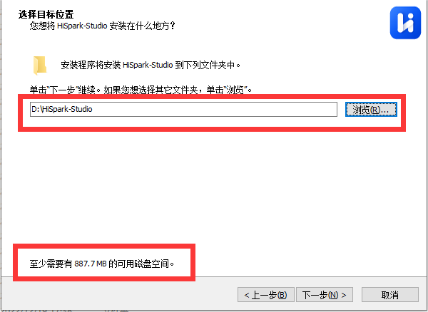

* 根据用户自身需要勾选附加任务，默认全部勾选，选择完成后，点击下一步。

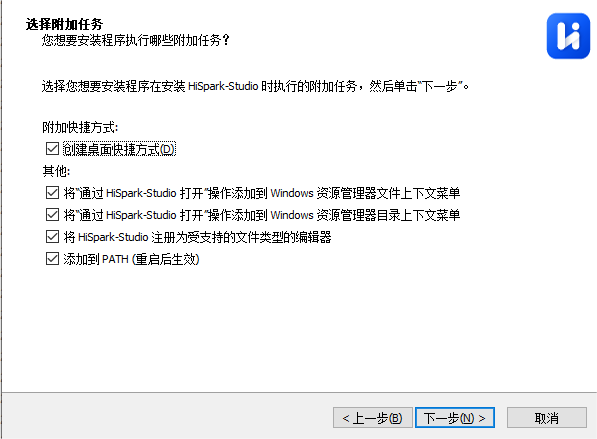

* 点击“安装”，进行工具的安装。


* 安装过程如下，等待安装完成。


* 出现如下界面代表安装完成，点击完成即可。

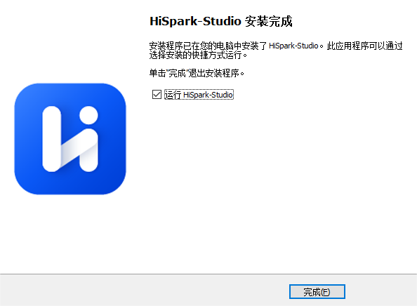

* HiSpark studio打开主页界面如下。


### 1.2 SDK代码下载

* 下载SDK代码，目前提供两种方式，第一种方式如下：

  * 第一种方式通过git指令下载（在Windows上使用git指令下载代码，需要提前安装git，这部分用户自行百度学习），在xx盘鼠标右键选择“Open Git Bash here”，如下图所所示

  

  * 在命令框中输入`git clone https：//gitee.com/HiSpark/open_mcu.git`指令下载代码，等待下载完成。

   

  ​			


* 第二种方式ZIP下载方式如下：

  * [SDK包下载地址](https：//gitee.com/HiSpark/open_mcu)，在主界面上点击“克隆/下载”，选择“下载ZIP”，等待下载，下载完成如下。

    

    

  * 解压“open_mcu_master”，解压方式选择“Extract Here”。

   

  

### 1.3 新建工程

* 代码下载完成后，打开HiSpark studio工具，点击“新建工程”。

  

* 新建工程界面中：“3061MNPICA”，工程名：“xxx”（用户自定义，但是不能带中文，特殊符号），软件包：“xxx/open_mcu-master/src”（SDK软件包存放路径，这个地方一定要选到src层级，否则新建会失败），配置选择完成后，点击“完成按钮”。

  

### 1.4 配置

- 点击进入配置器界面，可以根据模块硬件原理图“ECBMCU201MPC_VER_C_QN01”与“3061M系列 通用生态板用户手册 ”文件选择要配对的引脚，以下是配置器界面。

  > 原理图和用户手册文件路径在open_mcu\src\document\hardware\2. 3061\1. 3061 生态板参考设计篇
  >
  > 手册的路径在open_mcu\src\document\datasheet


- 可以通过配置器选择要使能的模块，在管脚视图查看或者配置对应引脚配置的选项，可以在右边的模块参数区修改模块的参数。最后点击生成代码即可。

  

- 可以在模块列表菜单里，点击样例，在表格视图里选择样例生成代码。

  

- 在代码视图里可以预览配置器自动生成的所有代码。

  

  

- 在图形化视图，可以通过图形化配置的方式修改模块参数，与右侧参数列表相对应。

  

  

- 打开左侧的资源管理器，查看列表的user/main.c文件，生成了一部分程序，右键点击SystemInit()跳转到定义。


- 可以看出系统已自动生成，配置器对引脚所做的配置的初始化代码。可以根据查看《SolarA² HAL和底层驱动程序说明 》来了解接口函数。

  > 《SolarA² HAL和底层驱动程序说明 》文件路径open_mcu-master\src\document\software


- 配置好后，点击.jpg)编译代码，终端打印“success”完成编译。

    

    

### 1.5 工程烧录

#### 1.5.1HiSpark-Link烧录

- 步骤一：HiSpark-Link需要先安装FTDI驱动，该驱动需要通过zadig.exe转换为WinUSB才可被 Windows操作系统识别，将HiSpark-Link调试器通过USB连接电脑上电（如果是Typec供电，则将跳线帽跳到5V USB，如果是12V供电，则跳线帽跳到5N_IN）。

  > 安装FTDI驱动操作步骤参考此文档"[参考tools目录README搭建环境](https：//gitee.com/HiSpark/open_mcu/tree/master/tools)"

  

- 步骤二：进入工程配置界面。打开要烧录的工程后，单击顶部的图标，进入工程配置界面->进入程序加载。选择传输方式为“swd”，并配置其他参数。

  

- 步骤三：单击“烧录” 按钮，开始烧录。烧录成功后终端窗口输出如下图所示。

  

#### 1.5.2HiSpark-Trace烧录

- 步骤一：将调试器连接主机端，将开发板接上电源线，连接好调试器与开发板。（如果是Typec供电，则将跳线帽跳到5V USB，如果是12V供电，则跳线帽跳到5N_IN）。

  > HiSpark-Trac烧录：注：HiSpark-Trace调试器有多个连接口，连接错误会导致烧录失败，注意检查。


- 步骤二：进入工程配置界面。打开要烧录的工程后，单击顶部的图标，进入工程配置界面->进入程序加载。选择传输方式为“swd”或者“jtag”并配置其他参数。


- 步骤三：单击“烧录” 按钮，开始烧录。烧录成功后终端窗口输出如下图所示。


## 2、模拟比较器（ACMP）

### 2.1模拟比较器中断

#### 2.1.1实验目的

- 本实验通过ACMP0_OUT(GPIO0_7)输出两个输入源的比较结果，并调用触发相应的回调函数，通过串口打印结果。


#### 2.1.2实验要求

- 原理：ACMP即模拟比较器,基于比较两个模拟信号的大小，并输出一个数字信号来表示它们之间的关系。当输入信号大于参考信号时，模拟比较器输出高电平；反之，则输出低电平。

- 硬件要求：3061M核心板；

  

- 支持API版本、SDK版本：SolarA2 1.0.1.2及以上版本

- 支持IDE版本号：HiSpark Studio 1.0.0.8及以上版本

#### 2.1.3核心函数说明

2.1.3.1HAL_ACMP_Init（）

| 定义：   | BASE_StatusType HAL_ACMP_Init(ACMP_Handle *acmpHandle) |
| -------- | ------------------------------------------------------ |
| 功能：   | 比较器HAL初始化                                        |
| 参数：   | acmpHandle：ACMP 句柄，详细参考ACMP_Handle             |
| 返回值： | BASE_StatusType                                        |
| 依赖：   | acmp.h                                                 |

2.1.3.2HAL_ACMP_SetHystVol（）

| 定义：   | void HAL_ACMP_SetHystVol(ACMP_Handle *acmpHandle, ACMP_HystVol voltage) |
| -------- | ------------------------------------------------------------ |
| 功能：   | 设置迟滞电压                                                 |
| 参数：   | dacHandle：ACMP 句柄，详细参考ACMP_Handle<br />voltage：要设置迟滞电压，详细参考ACMP_HystVol |
| 返回值： | BASE_StatusType：OK, ERROR                                   |
| 依赖：   | acmp.h                                                       |

2.1.3.3 HAL_ACMP_BlkingValid（）

| 定义：   | void HAL_ACMP_BlkingValid(ACMP_Handle *acmpHandle) |
| -------- | -------------------------------------------------- |
| 功能：   | 屏蔽使能配置                                       |
| 参数：   | dacHandle：ACMP 句柄，详细参考ACMP_Handle          |
| 返回值： | 无                                                 |
| 依赖：   | acmp.h                                             |

2.1.3.4 HAL_ACMP_ResultSelect（）

| 定义：   | BASE_StatusType HAL_ACMP_ResultSelect(ACMP_Handle *acmpHandle, ACMP_ResultSelect resultSelect) |
| -------- | ------------------------------------------------------------ |
| 功能：   | 比较输出结果选择                                             |
| 参数：   | dacHandle：ACMP 句柄，详细参考ACMP_Handle<br />resultSelect：ACMP结果输出选项 |
| 返回值： | BASE_StatusType：OK, ERROR.                                  |
| 依赖：   | acmp.h                                                       |

#### 2.1.4实验流程

- 步骤一：点击配置器选择Acmp Interrupt样例，并点击生成代码。


- 步骤二：选择要使能驱动模块，在配置界面配置驱动模块。


- 步骤三：在配置界面可以修改ACMP0驱动模块参数配置。

  

  

  核心代码如下：

- ACMP初始化

   

- ACMP回调函数

  .jpg) 

- 步骤四：如果需要串口打印就需配置以下操作。

  

- 步骤五：点击.jpg)编译代码，编译完成后，点击烧录代码。


#### 2.1.5实验结果

- 烧录成功后，打开串口工具，按一下开发板RESET按键复位开发板，可以看到串口打印出来了写入UART0的数据。N极对应的是GPIO2_6,将N极接地，P极由内部DAC提供电压（0.8v），P极就大于N极，会触发正向回调函数。通过串口输出“ACMP positive callback function”与“ACMP edge callback funtion”，可以看出成功调用了正向回调函数和边缘回调函数，输出比较结果为上升沿。说明ACMP比较器中断驱动实验成功。 

​      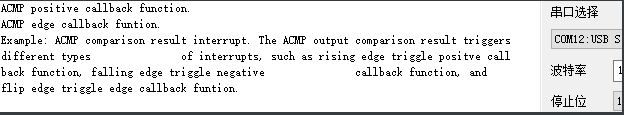 

#### 2.1.6扩展实验

本实验学习使用ACMP比较器中断实验，请学生做如下实验：
- 将GPIO2_6接3.3V，查看是否会触发回调函数。

  

### 2.2内部DAC数模转化实验

#### 2.2.1实验目的

- 通过设置输入的P端信号为DAC的内部输出来，设置N端输入端的信号为GPIO2_6,对两个输入源进行电压比较，最后GPIO0_7输出比较结果。


#### 2.2.2实验要求

- 原理：DAC（数模转化器）的工作原理基于输入的数字信号，通过一系列电子元件将数字信号转换为模拟信号。

- 硬件要求：3061M核心板；

  

- 工具要求：万用表

  

- 支持API版本、SDK版本：SolarA2 1.0.1.2及以上版本

- 支持IDE版本号：HiSpark Studio 1.0.0.8及以上版本

  

#### 2.2.3核心函数说明

2.2.3.1  HAL_DAC_Init()

| 定义：   | BASE_StatusType HAL_DAC_Init(DAC_Handle *dacHandle) |
| -------- | --------------------------------------------------- |
| 功能：   | 初始化DAC                                           |
| 参数：   | handle：DAC参数句柄                                 |
| 返回值： | BASE_StatusType                                     |
| 依赖：   | dac.h                                               |

2.2.3.2  HAL_DAC_SetValue()

| 定义：   | void HAL_DAC_SetValue(DAC_Handle *dacHandle, unsigned int value) |
| -------- | ------------------------------------------------------------ |
| 功能：   | 转换值配置                                                   |
| 参数：   | handle：DAC参数句柄<br />value：DAC的值                      |
| 返回值： | None                                                         |
| 依赖：   | dac.h                                                        |

#### 2.2.4实验流程

- 步骤一：点击配置器选择Acmp Out Result样例，并点击生成代码。

  

  

- 步骤二：选择要使能驱动模块，在配置界面配置驱动模块。

  

- 步骤三：在配置界面可以修改DAC0驱动模块参数配置。

  

  核心代码如下：

- ACMP与DAC初始化

   

- 步骤四：如果需要串口打印就需配置以下操作。

  

- 步骤五：点击.jpg)编译代码，编译完成后，点击烧录代码。

- 步骤六：用万用表检测GPIO0_7引脚的电压。

#### 2.2.5实验结果

- 烧录成功后，打开串口工具，按一下开发板RESET按键复位开发板，可以看到串口打印出来了写入UART0的数据。N极接地，P极输入源从DAC输出（0.8V），P极电压大于N极电压，最后GPIO0_7结果输出3.3V电压。


​        

​        


#### 2.2.6扩展实验

本实验学习使用ACMP比较器中断实验，请学生做如下实验：

- 交换N端口输入电压，并测量输出端的电压，比较输入源的电压大小。
- 输入的比较电压不能超过0V~输入电源大小（3.3V）。

- 最小可识别有效差分输入电压为20mV。


## 3、高级PWM定时器（APT）

### 3.1使用APT对ADC进行周期采样功能

#### 3.1.1实验目的

- 通过配置APT模块来控制PWM波的输出，查看其生成的波形，并观察其计数方向的变化，还有死区的时间。

#### 3.1.2实验要求

- 原理：APT 为高级 PWM 定时器模块，APT模块通过高级PWM信号的产生与调节，结合单电阻采样技术，实现对电机的精确速度控制和电流采样，从而优化电机的性能和效率。

- 硬件要求：3061M核心板；

  

- 工具需求：示波器

- 支持API版本、SDK版本：SolarA2 1.0.1.2及以上版本

- 支持IDE版本号：HiSpark Studio 1.0.0.8及以上版本


#### 3.1.3核心函数说明

3.1.3.1  HAL_APT_MasterSyncInit()

| 定义：   | BASE_StatusType HAL_APT_MasterSyncInit(APT_Handle *aptHandle, unsigned short syncOutSrc) |
| -------- | ------------------------------------------------------------ |
| 功能：   | 使用多重同步模式时，初始化主APT模块                          |
| 参数：   | aptHandle：APT_Handle句柄，详细参考APT_Handle<br />syncOutSrc：主APT模块同步源 |
| 返回值： | BASE_StatusType：OK, ERROR, BUSY, TIMEOUT.                   |
| 依赖：   | apt.h                                                        |

3.1.3.2 HAL_APT_SlaveSyncInit()

| 定义：   | BASE_StatusType HAL_APT_SlaveSyncInit(APT_Handle *aptHandle, APT_SlaveSyncIn *slaveSyncIn) |
| -------- | ------------------------------------------------------------ |
| 功能：   | 初始化从属APT模块                                            |
| 参数：   | aptHandle：APT_Handle句柄，详细参考APT_Handle<br />slaveSyncIn：从属APT模块同步handle |
| 返回值： | BASE_StatusType：OK, ERROR, BUSY, TIMEOUT.                   |
| 依赖：   | apt.h                                                        |

3.1.3.3 HAL_APT_StopModule()

| 定义：   | void HAL_APT_StopModule(unsigned int aptRunMask)   |
| -------- | -------------------------------------------------- |
| 功能：   | 同时停止所有已使用的APT模块                        |
| 参数：   | aptRunMask：可以作为aptRunMask传递的有效值的逻辑OR |
| 返回值： | void                                               |
| 依赖：   | apt.h                                              |

3.1.3.4 HAL_APT_SetPWMDutyByNumber()

| 定义：   | BASE_StatusType HAL_APT_SetPWMDutyByNumber(APT_Handle *aptHandle, unsigned int duty) |
| -------- | ------------------------------------------------------------ |
| 功能：   | 沿PWM波形的左右边缘设置计数比较点。修改占空比                |
| 参数：   | aptHandle：APT_Handle句柄，详细参考APT_Handle<br />duty：PWM占空比。范围：1~99 |
| 返回值： | BASE_StatusType：OK, ERROR, BUSY, TIMEOUT                    |
| 依赖：   | apt.h                                                        |

3.1.3.5 HAL_APT_ProtectInitEx（）

| 定义：   | BASE_StatusType HAL_APT_ProtectInitEx(APT_Handle *aptHandle, APT_OutCtrlProtectEx *protect) |
| -------- | ------------------------------------------------------------ |
| 功能：   | 初始化APT模块（扩展接口）的输出控制保护事件                  |
| 参数：   | aptHandle：APT_Handle句柄，详细参考APT_Handle<br />protect：输出控制保护事件数据 |
| 返回值： | BASE_StatusType：OK, ERROR, BUSY, TIMEOUT                    |
| 依赖：   | apt.h<br />apt_ip.h                                          |

#### 3.1.4实验流程

- 步骤一：点击配置器选择Adc Associativetrigger Of Apt样例，并点击生成代码。

  

  

- 步骤二：选择要使能驱动模块，在配置界面配置驱动模块。

  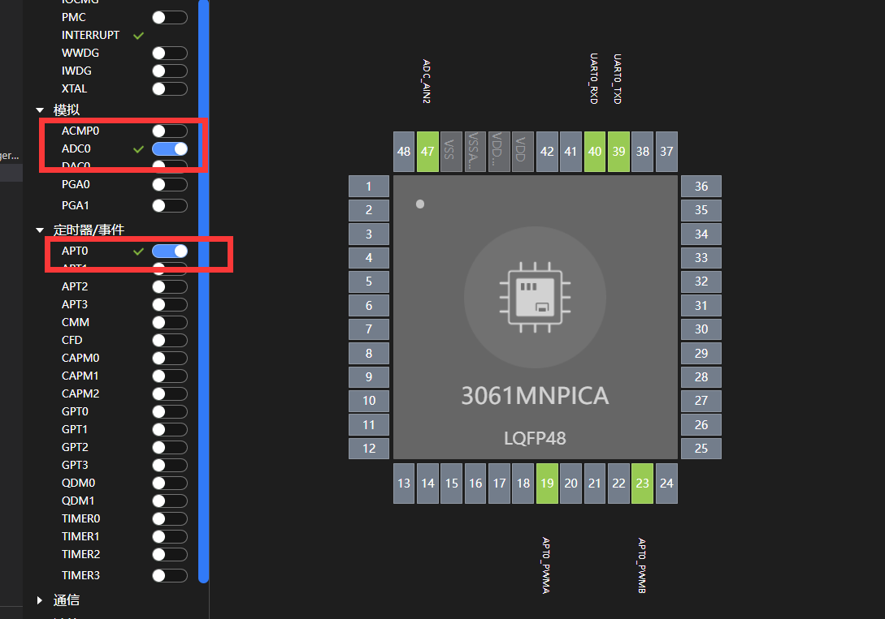

- 步骤三：在配置界面可以修改APT、ADC驱动模块参数配置。

  

  

  核心代码如下：

- APT初始化

   

- APT保护功能初始化

   

- ADC初始化

  ​     

- ADC中断回调函数

   

- 例程封装

   

- 步骤四：如果需要串口打印就需配置以下操作

  

- 步骤五：点击.jpg)编译代码，编译完成后，点击烧录代码。

- 步骤六：用示波器接APT0_PWMA(GPIO3_0)、APT0_PWMB(GPIO4_0)。

  

  


#### 3.1.5实验结果

- 烧录成功后，打开串口工具，可以看到串口打印出来了写入UART0的数据。可以看出APT运行输出PWM波时会触发ADC采样，ADC中断回调函数中读取结果输出打印GPIO4_7引脚的电压。


​        

- 通过示波器能够观察到，APT0的A/B两路都有PWM波的输出，且A/B两路输出的波形互补。

- 死区的宽度：插入死区的宽度 = 工作时钟周期 *  死区延时计数值，该示例Dead Band Cnt的值为60，计算出来是400ns，示波器测试出来是401.1ns，在合理误差内，实验成功。

​      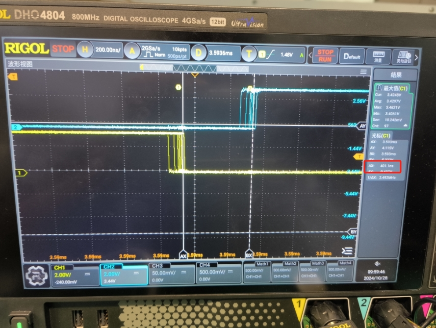 

#### 3.1.6扩展实验

本实验学习使用使用APT对ADC进行周期采样功能实验，请学生做如下实验：

- 修改占空比，观察其现象。

  提示：

- 占空比可通过“HAL_APT_SetPWMDutyByNumber”进行更改
- 分频器的分频系数的范围为 0到4095，计数器的计数周期值的范围为 0到65535。死区延时计数值范围 0到65535。
- PWM 波的频率：

  ```c
  ①递增/递减计时模式，PWM 波的频率 = 工作时钟频率 / ((分频器的分频系数+1)*(计数器的计数周期值+1));
  ②先增后减计时模式，PWM 波的频率 = 工作时钟频率 / ((分频器的分频系数+1)*(计数器的计数周期值*2))。
  ```

- 死区的宽度：插入死区的宽度 = 工作时钟周期 * 死区延时计数值。 


## 4、控制器域网（CAN）

### 4.1 接收发扩展帧数据

#### 4.1.1实验目的

- 测试和验证CAN总线通信的硬件接口和软件驱动程序是否能够正确地发送和接收数据。

#### 4.1.2实验要求

- 原理：CAN总线是一种用于实时应用的串行通信协议总线，CAN总线中的数据传输通过帧的方式进行，帧类型包括数据帧、远程帧、错误帧和过载帧。数据帧负责数据从发送器到接收器的传输，远程帧用于请求相同数据，错误帧在检测到总线错误时发出，过载帧提供两数据帧或远程帧之间的延时。

- 硬件要求：3061M核心板；CAN接收器；CAN transceiver;

  
  
  

 

- 支持API版本、SDK版本：SolarA2 1.0.1.2及以上版本

- 支持IDE版本号：HiSpark Studio 1.0.0.8及以上版本

#### 4.1.3核心函数说明

3.1.3.1  HAL_CAN_Write()

| 定义：   | BASE_StatusType HAL_CAN_Write(CAN_Handle *canHandle, CANFrame *data) |
| -------- | ------------------------------------------------------------ |
| 功能：   | 立即发送数据                                                 |
| 参数：   | canHandle：CAN_Handle类型变量<br />data：待发送CAN数据帧的指针地址 |
| 返回值： | BASE status type：OK, ERROR, BUSY, TIMEOUT                   |
| 依赖：   | can.h                                                        |

3.1.3.2  HAL_CAN_ReadIT()

| 定义：   | BASE_StatusType HAL_CAN_ReadIT(CAN_Handle *canHandle, CANFrame *data, CAN_FilterConfigure *filterConfigure) |
| -------- | ------------------------------------------------------------ |
| 功能：   | 异步接收CAN数据帧                                            |
| 参数：   | canHandle：CAN_Handle类型变量<br />data：用于存储CAN数据帧的地址<br />filterConfigure：过滤配置的处理， |
| 返回值： | BASE status type：OK, ERROR, BUSY, TIMEOUT                   |
| 依赖：   | can.h                                                        |

#### 4.1.4实验流程

- 步骤一：点击配置器选择CAN Sample样例，并点击生成代码。

  

- 步骤二：选择要使能驱动模块，在配置界面配置驱动模块。

  

- 步骤三：在配置界面可以修改CAN驱动模块参数配置。

​        ​ 

核心代码如下：

- CAN初始化

  .jpg) 

- CAN中断回调函数

   

- 封装例程

   

- 步骤四：如果需要串口打印就需配置以下操作。


- 步骤五：点击.jpg)编译代码，编译完成后，点击烧录代码。

- 步骤六：CAN transceiver的tx和rx对应接开发板的CAN_0TX（GPIO3_5）和CAN_RX(GPIO3_6),CAN transceiver的H与L对接CAN收发器的H与L，CAN transceiver接电和接地，最后CAN收发器与上位机通过USB连接。

  

#### 4.1.5实验结果

打开GCAN Tools调试分析软件和串口调试助手，先开发板发送数据，串口打印“CAN Write Finish”,上位机接收数据，然后通过上位机发送数据，开发板接收数据并打印数据。证明实验成功。

 


## 5、捕获模块（CAPM）

### 5.1  CAPM读取电机位置传感器

#### 5.1.1实验目的

- 转动电机，通过CAPM来实现捕获电机上HALL位置传感器的电平。

#### 5.1.2实验要求

- 原理：通过检测霍尔元件的状态变化，可以确定电机转子的角度和位置。

- 硬件要求：3061M核心板，24V杰美康电机；

  

  
  
- 支持API版本、SDK版本：SolarA2 1.0.1.2及以上版本
  
- 支持IDE版本号：HiSpark Studio 1.0.0.8及以上版本
  
  


#### 5.1.3核心函数说明

5.1.3.1  CAPM_CalculateLevel()

| 定义：   | static unsigned char CAPM_CalculateLevel(CAPM_Handle *handle) |
| -------- | ------------------------------------------------------------ |
| 功能：   | 计算当前水平                                                 |
| 参数：   | canHandle：CAPM参数句柄                                      |
| 返回值： | unsigned char类型变量                                        |
| 依赖：   | can.h                                                        |

5.1.3.2  HAL_CAPM_GetNextLoadECRNum()

| 定义：   | unsigned char HAL_CAPM_GetNextLoadECRNum(CAPM_Handle *handle) |
| -------- | ------------------------------------------------------------ |
| 功能：   | 获取下一个要加载的ECR的编号。                                |
| 参数：   | canHandle：CAPM参数句柄                                      |
| 返回值： | 下一个ECR编号：Next_LOAD_ECR0、Next_LOAD-ECR1、Next_LAND_ECR2、Next_LOAD_ECR3。 |
| 依赖：   | can.h                                                        |

5.1.3.3  HAL_CAPM_GetECRValue()

| 定义：   | unsigned int HAL_CAPM_GetECRValue(CAPM_Handle *handle, CAPM_ECRNum ecrNum) |
| -------- | ------------------------------------------------------------ |
| 功能：   | 获取ECR的编号。                                              |
| 参数：   | canHandle：CAPM参数句柄<br />ecrNum：ECR编号                 |
| 返回值： | unsigned char类型变量                                        |
| 依赖：   | can.h                                                        |

5.1.3.3  HAL_CAPM_GetECRValue()

| 定义：   | unsigned int HAL_CAPM_GetECRValue(CAPM_Handle *handle, CAPM_ECRNum ecrNum) |
| -------- | ------------------------------------------------------------ |
| 功能：   | 获取ECR的编号。                                              |
| 参数：   | canHandle：CAPM参数句柄<br />ecrNum：ECR编号                 |
| 返回值： | unsigned char类型变量                                        |
| 依赖：   | can.h                                                        |

#### 5.1.4实验流程

- 步骤一：点击配置器选择Capm Sample样例，并点击生成代码。

  

- 步骤二：选择要使能驱动模块，在配置界面配置驱动模块。

  

- 步骤三：在配置界面可以修改CAPM驱动模块参数配置。

​                       ​     

​                      ​          

核心代码如下：

- CAMP初始化

   

   

   

- 获取霍尔传感器的电平信息

   

- 拼接3个霍尔传感器的电平成霍尔位置值

   

- 封装例程

   

- 步骤四：如果需要串口打印就需配置以下操作。


- 步骤五：点击.jpg)编译代码，编译完成后，点击烧录代码。

- 步骤六：扩展板H1、H2、H3引脚连接到电机的霍尔传感器接口。

   

- 步骤七：找到capm_hall_sample.c文件,在CAPM_GetHallValue()函数里将定义的4个变量放在函数外做全局变量。

   

- 步骤八：点击.jpg)变量跟踪功能来查看hallALevel, hallBLevel, hallCLevel;hallPosition来监视这四个变量的变化。

   


#### 5.1.5实验结果

- 烧录成功后，用手转动电机，先查看hallALevel, hallBLevel, hallCLevel这3个霍尔传感器电平变化，可以看到捕获到霍尔传感器的电平信息随着电机的转动而变化。

​          

- 然后打开串口调试器查看和查看hallPosition值的变化，看到其值随着转动电机的变化证明实验成功。

  

  

#### 5.1.6扩展实验

- 本实验学习了使用三个CAPM捕获三个HALL传感器的电平信息，通过用手转动电机可以看出霍尔传感器的电平变化速度不均匀。可以通过电机转动的案例让电机转动起来，检测其案例这四个变量的变化。

  

  

## 6、时钟失效检测（CFD）

### 6.1 验证CFD的时钟失效保护功能

#### 6.1.1实验目的

- 验证CFD的时钟失效保护功能，监测目标时钟（HOSC或TCXO）是否失效，通过每隔5s分别注入时钟失效中断和解除时钟失效中断。

#### 6.1.2实验要求

- 原理：CFD的时钟失效保护功能原理主要依赖于电路的内部逻辑、备用时钟以及优化算法，以确保在时钟信号丢失或不稳定的情况下，CFD电路仍然能够正确地处理和传输数据，从而保证系统的稳定运行和数据的有效性‌。

- 硬件要求：3061M核心板；

  
  
- 支持API版本、SDK版本：SolarA2 1.0.1.2及以上版本
  
- 支持IDE版本号：HiSpark Studio 1.0.0.8及以上版本


#### 6.1.3核心函数说明

6.1.3.1  DCL_CFD_GetCntValue()

| 定义：   | static inline unsigned int DCL_CFD_GetCntValue(CFD_RegStruct *cfdx) |
| -------- | ------------------------------------------------------------ |
| 功能：   | 内部计数器计数锁存值                                         |
| 参数：   | cfdx：CFD寄存器基址                                          |
| 返回值： | unsigned int 类型的锁存值。                                  |
| 依赖：   | cfd_ip.h                                                     |

6.1.3.2 DCL_CFD_EnableInterruptInject()

| 定义：   | static inline void DCL_CFD_EnableInterruptInject(CFD_RegStruct *cfdx, CFD_Interrupt_Type type) |
| -------- | ------------------------------------------------------------ |
| 功能：   | 注入指定类型的中断                                           |
| 参数：   | cfdx：CFD寄存器基址<br />type：中断类型的掩码                |
| 返回值： | None                                                         |
| 依赖：   | cfd_ip.h                                                     |

6.1.3.2 DCL_CFD_DisableInterruptInject()

| 定义：   | static inline void DCL_CFD_DisableInterruptInject(CFD_RegStruct *cfdx, CFD_Interrupt_Type type) |
| -------- | ------------------------------------------------------------ |
| 功能：   | 停止注入指定类型的中断                                       |
| 参数：   | cfdx：CFD寄存器基址<br />type：中断类型的掩码                |
| 返回值： | None                                                         |
| 依赖：   | cfd_ip.h                                                     |

#### 6.1.4实验流程

- 步骤一：点击配置器选择Cfd Check Error样例，并点击生成代码。

  

- 步骤二：选择要使能驱动模块，在配置界面配置驱动模块。

  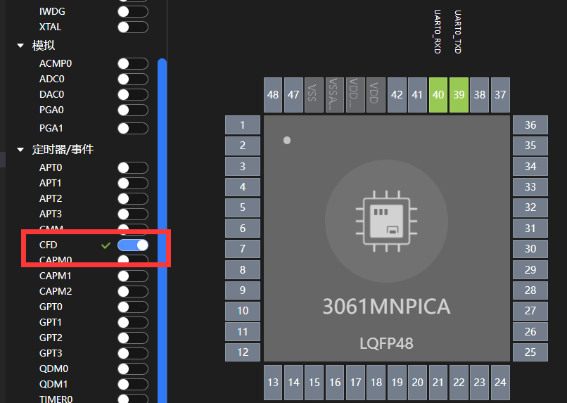

- 步骤三：在配置界面可以修改CFD驱动模块参数配置。

  

  核心代码如下：

- CFD初始化

    

- CFD中断回调函数

   

- 例程封装

   

- 步骤四：如果需要串口打印就需配置以下操作。


- 步骤五：点击.jpg)编译代码，编译完成后，点击烧录代码。


#### 6.1.5实验结果

- 烧录成功后，打开串口工具，可以看到串口打印出来了写入UART0的数据，打印6次正常的CFD计数值，注入错误后，打印6次中断回调，后重新打印正常CFD计数值，循环进行。这现象说明实验成功。

   

提示：
- 时钟失效中断触发硬件系统事件2会自动关闭APT并将主时钟切换为LOSC进行保护，用户可在中断服务函数中进行时钟恢复或者复位等安全操作；
- 每次中断触发后自行判断计数值是否在门限内，非门限内则判定为异常时钟；目标时钟分配比固化为2048分频，参考时钟不分频。

## 7、时钟频率监控（CMM）

### 7.1 验证CMM时钟功能

#### 7.1.1实验目的

- 检查目标时钟（LOSC/HOSC/TCXO/HS_CLK/LS_CLK）频率是否发生错误。每隔5s分别注入频率错误中断，验证CMM的频率中断处理函数。

#### 7.1.2实验要求

- 原理：CMM时钟的频率监测功能通过高精度时钟同步技术和先进的频率测量技术，实现了对时钟频率的高精度测量和同步，cmm注入错误前后监测目标时钟异常功能。

- 硬件要求：3061M核心板；

  
  
- 支持API版本、SDK版本：SolarA2 1.0.1.2及以上版本
  
- 支持IDE版本号：HiSpark Studio 1.0.0.8及以上版本


#### 7.1.3核心函数说明

7.1.3.1  DCL_CMM_GetCntValue()

| 定义：   | static inline unsigned short DCL_CMM_GetCntValue(CMM_RegStruct *cmmx) |
| -------- | ------------------------------------------------------------ |
| 功能：   | 内部计数器计数锁存值。                                       |
| 参数：   | cmmx：CMM寄存器基址                                          |
| 返回值： | unsigned short.类型的锁存值。                                |
| 依赖：   | cmm_ip.h                                                     |

7.1.3.2 DCL_CMM_EnableInterruptInject()

| 定义：   | static inline void DCL_CMM_EnableInterruptInject(CMM_RegStruct *cmmx, CMM_Interrupt_Type type) |
| -------- | ------------------------------------------------------------ |
| 功能：   | 注入指定类型的中断。                                         |
| 参数：   | cmmx：CMM寄存器基址<br />type：中断类型的掩码。              |
| 返回值： | None                                                         |
| 依赖：   | cmm_ip.h                                                     |

7.1.3.2 DCL_CMM_DisableInterruptInject()

| 定义：   | static inline void DCL_CMM_DisableInterruptInject(CMM_RegStruct *cmmx, CMM_Interrupt_Type type) |
| -------- | ------------------------------------------------------------ |
| 功能：   | 停止注入指定类型的中断。                                     |
| 参数：   | cmmx：CMM寄存器基址<br />type：中断类型的掩码。              |
| 返回值： | None                                                         |
| 依赖：   | cmm_ip.h                                                     |

#### 7.1.4实验流程

- 步骤一：点击配置器选择Cmm Check Error样例，并点击生成代码。

  

- 步骤二：选择要使能驱动模块，在配置界面配置驱动模块。

  

- 步骤三：在配置界面可以修改CMM驱动模块参数配置。

  

  核心代码如下：

- CMM初始化

   

- CMM中断回调函数

   

- 封装例程

  .jpg) 

- 步骤四：如果需要串口打印就需配置以下操作


- 步骤五：点击.jpg)编译代码，编译完成后，点击烧录代码。


#### 7.1.5实验结果

- 烧录成功后，打开串口工具，可以看到串口打印出来了写入UART0的数据，打印5次正常的CMM计数器锁存值（目标分频为8192），接着打印1遍“ Inject interrupt type error !”，注入错误后，打印5次“In CMM interrupt function ：clock frequency error”，再打印一遍“Disable inject interrupt type error”,后重新打印正常CMM计数器锁存值，循环进行。这现象说明实验成功。

 

#### 7.1.6扩展实验

- 本实验学习验证CMM时钟频率监测功能，并验证CMM频率错误中断功能，请学生做如下实验：

- 改变目标时钟源和分频比，测试其现象。

提示：上下限值的范围可反应系统对目标时钟偏差的冗余度，可自行设计门限值和时钟分频比，门限值具体计算方法请参照技术指南


## 8、循环冗余校验计算单元（CRC）


### 8.1CRC算法验证

#### 8.1.1实验目的

- 通过load初始值配置，配置算法修改为CRC16_CCIT-FALSE，并对同一组数据进行CRC运算验证。

#### 8.1.2实验要求

- 原理：CRC（循环冗余校验）是一种用于检测数据传输或存储后可能出现的错误的校验方法，然后CRC16_XMODEM算法的具体步骤包括初始化CRC寄存器、逐字节处理数据、应用多项式进行运算，并最终生成一个16位的CRC值，这个值被附加到数据后面，以便接收方进行校验。在CRC16_CCITT-FALSE算法中，输入数据在计算之前会进行预处理，通常是将初始值设为0xFFFF。生成多项式为x^16^ +  x^12^+x^5^+1，这个多项式用于与输入数据进行模2除法运算，以生成16位的CRC值。

- 硬件要求：3061M核心板；

  
  
- 支持API版本、SDK版本：SolarA2 1.0.1.2及以上版本
  
- 支持IDE版本号：HiSpark Studio 1.0.0.8及以上版本


#### 8.1.3核心函数说明

8.1.3.1  HAL_CRC_SetInputDataGetCheck()

| 定义：   | unsigned int HAL_CRC_SetInputDataGetCheck(CRC_Handle *handle, unsigned int data) |
| -------- | ------------------------------------------------------------ |
| 功能：   | 设置CRC输入数据并获得CRC输出                                 |
| 参数：   | handle：CRC参数句柄<br />data：CRC输入数据                   |
| 返回值： | unsigned int类型的CRC输出数据。                              |
| 依赖：   | crc.h                                                        |

8.1.3.2 HAL_CRC_SetCheckInData()

| 定义：   | void HAL_CRC_SetCheckInData(CRC_Handle *handle, unsigned int data) |
| -------- | ------------------------------------------------------------ |
| 功能：   | 将CRC check_in数据设置为注册                                 |
| 参数：   | handle：CRC参数句柄<br />data：CRC输入数据                   |
| 返回值： | None                                                         |
| 依赖：   | crc.h                                                        |

8.1.3.3 HAL_CRC_LoadCheckInData()

| 定义：   | unsigned int HAL_CRC_LoadCheckInData(CRC_Handle *handle) |
| -------- | -------------------------------------------------------- |
| 功能：   | 将CRC校验输入寄存器数据加载到CRC_out寄存器               |
| 参数：   | handle：CRC参数句柄                                      |
| 返回值： | unsigned int 类型 反转check_in数据                       |
| 依赖：   | crc.h                                                    |

#### 8.1.4实验流程

- 步骤一：点击配置器选择Crc Load Algo样例，并点击生成代码。

  

- 步骤二：选择要使能驱动模块，在配置界面配置驱动模块。

  

- 步骤三：在配置界面可以修改CRC驱动模块参数配置。

  

  核心代码如下：

- CRC初始化

   

- 封装例程

   

- 步骤四：如果需要串口打印就需配置以下操作。


- 步骤五：点击.jpg)编译代码，编译完成后，点击烧录代码。

  

#### 8.2.5实验结果

烧录成功后，打开串口工具，按一下开发板RESET按键复位开发板，可以看到串口打印出来了写入UART0的数据,CRC16_XMODEM算法输出的数据是0x5B86,

修改后的初始值为0xFFFF，修改成CRC16_CCIT-FALSE算法后输出数据是0xDF46，证明验证成功。


#### 8.2.6扩展实验

- 本实验学习通过改变初始值配置，对同一组数据进行不同CRC算法运算验证，请学生做如下实验：

- 用同一组数据用CRC16_CCITT算法与CRC16_XMODEM算法运算认证。
- 调用“HAL_CRC_CheckInputData（）”检查接收到的数据CRC值是否与预期值相同。


## 9、直接内存访问（DMA）

### 9.1 DMA传输功能实验

#### 9.1.1实验目的

- 用DMA传输，从内存搬运到内存，DMA搬运结束后触发DMA中断，在中断回调函数中读取搬运后的结果。


#### 9.1.2实验要求

- 原理：DMA（内存直接访问）控制器负责设置数据的源地址和目的地址，以及数据的传输量，然后启动传输过程。传输完成后，DMA控制器会发送一个信号给CPU，通知它可以恢复之前的工作。

- 硬件要求：3061M核心板；

  
  
- 支持API版本、SDK版本：SolarA2 1.0.1.2及以上版本
  
- 支持IDE版本号：HiSpark Studio 1.0.0.8及以上版本

#### 9.1.3核心函数说明

9.1.3.1 HAL_DMA_RegisterCallback()

| 定义：   | void HAL_DMA_RegisterCallback(DMA_Handle *dmaHandle, DMA_CallbackFun_Type typeID,  DMA_ChannelNum channel, DMA_CallbackType pCallback) |
| -------- | ------------------------------------------------------------ |
| 功能：   | 用户回调函数注册界面                                         |
| 参数：   | dmaHandle：DMA_Handle类型的变量<br />typeID：回调函数类型的Id<br />channel：所选DMA通道的ID<br />pCallback：指定callbcak函数的指针 |
| 返回值： | None.                                                        |
| 依赖：   | dma.h                                                        |

9.1.3.2 HAL_DMA_StartIT()

| 定义：   | BASE_StatusType HAL_DMA_StartIT(DMA_Handle *dmaHandle, unsigned int srcAddr,  unsigned int destAddr, unsigned int dataLength, unsigned int channel) |
| -------- | ------------------------------------------------------------ |
| 功能：   | DMA在启用中断的情况下开始数据传输                            |
| 参数：   | dmaHandle：DMA_Handle类型的变量<br />srcAddr：数据源地址<br />destAddr：数据目标地址<br />dataLength：要传输的数据长度<br />channel：DMA通道编号 |
| 返回值： | BASE_StatusType：BASE_STATUS_OK, BASE_STATUS_ERROR, BASE_STATUS_BUSY, BASE_STATUS_TIMEOUT. |
| 依赖：   | dma.h                                                        |

#### 9.1.4实验流程

- 步骤一：点击配置器选择Dma Memtomem样例，并点击生成代码。

  

- 步骤二：按以下步骤打开DMA的配置窗口。

  

- 步骤三：在DMA配置窗口可以修改配置，修改完点击确认。

  

  核心代码如下：

- DMA初始化

   

- DMA中断回调函数

   

- 封装例程

   

- 步骤四：如果需要串口打印就需配置以下操作。


- 步骤五：点击.jpg)编译代码，编译完成后，点击烧录代码。

#### 9.1.5实验结果

- 烧录成功后，打开串口工具，按一下开发板RESET按键复位开发板，可以看到串口打印出来了写入UART0的数据,通过数据可以看出传输开始时，目标地址里的数据是空的，启动动DMA传输，触发DMA中断读取数据后，输出dest里数据是12345678，源地址的数据src传输到了的dest目标地址里。证明实验成功。


​      

#### 9.1.6扩展实验

本实验学习通过配置DMA内存到内存传输功能，中断回调中读取搬运结果，请学生做如下实验：

- 尝试指针类型和结构体类型的数据进行传输，查看其现象。


## 10、嵌入式闪存（FLASH）

### 10.1 FLASH的擦除、写入实验

#### 10.1.1实验目的

通过中断方式对FLASH的PAGE 58-61区域进行擦除、写入，通过Debug串口打印读取的操作数据。

#### 10.1.2实验要求

- 原理：Flash存储器属于[EEPROM](https：//www.baidu.com/s?sa=re_dqa_generate&wd=EEPROM&rsv_pq=cd542fe800a8d193&oq=FLASH基本操作原理&rsv_t=15752OAtQ1lt5V8N/+UkwFYtgIeZSfxIx/NPFkGET4HviYXp7A7rSIxx+C4&tn=baidu&ie=utf-8)的一种，可以通过电擦除，Flash的分层结构包括页、扇区和块，其中页是最小的可擦除单元，而读操作的最小单元为字节。

- 硬件要求：3061M核心板；

  
  
- 支持API版本、SDK版本：SolarA2 1.0.1.2及以上版本
  
- 支持IDE版本号：HiSpark Studio 1.0.0.8及以上版本

#### 10.1.3核心函数说明

10.1.3.1 HAL_FLASH_RegisterCallback()

| 定义：   | BASE_StatusType HAL_FLASH_RegisterCallback(FLASH_Handle *handle, FLASH_CallbackFunType pcallback) |
| -------- | ------------------------------------------------------------ |
| 功能：   | 注册Flash模块的回调函数                                      |
| 参数：   | handle：FLASH_Handle类型的变量<br />pcallback：指向回调函数的指针 |
| 返回值： | BASE_StatusType：BASE_STATUS_OK, BASE_STATUS_ERROR, BASE_STATUS_BUSY, BASE_STATUS_TIMEOUT. |
| 依赖：   | flash.h                                                      |

10.1.3.2  FlashInterruptHandle()

| 定义：   | static void FlashInterruptHandle(void *handle, FLASH_CallBackEvent event, unsigned int opAddr) |
| -------- | ------------------------------------------------------------ |
| 功能：   | Flash中断,判断事件并输出数据                                 |
| 参数：   | handle：Flash handle<br />event：Flash回调事件<br />opAddr：当前操作地址 |
| 返回值： | None                                                         |
| 依赖：   | flash.h                                                      |

10.1.3.3 HAL_FLASH_EraseIT（）

| 定义：   | BASE_StatusType HAL_FLASH_EraseIT(FLASH_Handle *handle, FLASH_EraseMode eraseMode,FLASH_SectorAddr startAddr, unsigned int eraseNum) |
| -------- | ------------------------------------------------------------ |
| 功能：   | 写入在中断模式下擦除flash。                                  |
| 参数：   | handle：Flash handle<br />eraseMode：擦除模式。选项包括擦除和页面擦除<br />startAddr：要擦除的flash的起始地址，地址必须与最小可擦除单位对齐<br />eraseNum：要擦除的页数 |
| 返回值： | None                                                         |
| 依赖：   | flash.h                                                      |

10.1.3.4 HAL_FLASH_WriteIT（）

| 定义：   | BASE_StatusType HAL_FLASH_WriteIT(FLASH_Handle *handle, unsigned int srcAddr,unsigned int destAddr, unsigned int srcLen) |
| -------- | ------------------------------------------------------------ |
| 功能：   | 在中断模式下写入flash。                                      |
| 参数：   | handle：Flash handle<br />srcAddr：要写入的数据缓冲区的起始地址<br />destAddr：要写入的flash的起始地址。地址必须与最小可写单位对齐<br />srcLen：要写入的数据长度，单位：字节 |
| 返回值： | BASE_StatusType：BASE_STATUS_OK, BASE_STATUS_ERROR, BASE_STATUS_BUSY, BASE_STATUS_TIMEOUT. |
| 依赖：   | flash.h                                                      |

10.1.3.5 HAL_FLASH_Read（）

| 定义：   | BASE_StatusType HAL_FLASH_Read(FLASH_Handle *handle,unsigned int srcAddr,unsigned int readLen,unsigned char *dataBuff, unsigned int buffLen) |
| -------- | ------------------------------------------------------------ |
| 功能：   | 用于从flash读取数据的接口。                                  |
| 参数：   | handle：Flash handle<br />srcAddr：要读取的数据的flash地址。地址必须与最小可读单位对齐<br />readLen：读取数据长度，单位：字节<br />dataBuff：用于存储读取数据的缓冲区<br />buffLen：用于存储读取数据的缓冲区大小，单位：字节 |
| 返回值： | BASE_StatusType：BASE_STATUS_OK, BASE_STATUS_ERROR, BASE_STATUS_BUSY, BASE_STATUS_TIMEOUT. |
| 依赖：   | flash.h                                                      |

#### 10.1.4实验流程

- 步骤一：点击配置器选择Flsah Blocking Mode样例，并点击生成代码。

  

  核心代码如下：

- FLASH中断初始化

   

- FLASH中断服务函数

  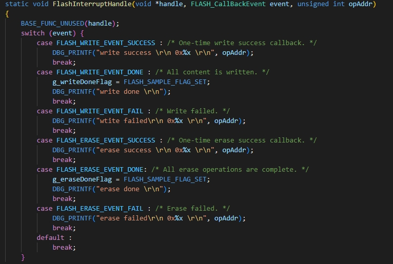 

- 封装例程

   

- 步骤二：如果需要串口打印就需配置以下操作。


- 步骤三：点击.jpg)编译代码，编译完成后，点击烧录代码。

#### 10.1.5实验结果

烧录成功后，打开串口工具，按一下开发板RESET按键复位开发板，可以看到串口打印出来了写入UART0的数据,该示例擦除、写入、读取4页，擦除成功串口输出"erase success"，写入成功输出"write success".,读取成功输出"read addr ：0x5A(4096个)"，由此可见实验成功。

  

#### 10.1.6扩展实验

本实验学习通过配置FLASH以中断方式进行擦除、写入，通过Debug串口打印读取操作数据，请学生做如下实验

- 擦除、写、读的块和字节，并串口打印出现象。

  

## 11、通用输入输出（GPIO）

### 11.1 按键检测实验

#### 11.1.1实验目的

完成GPIO控制器初始化和功能配置，通过中断来实现对按键的检测。

#### 11.1.2实验要求

- 原理：GPIO，即通用输入输出端口，是计算机或其他电子设备中用于与外部设备进行通信和控制的一种接口，从原理图分析出，该开发板的按键接入的是GPIO2_4。

- 硬件要求：3061M核心板；

  
  
- 支持API版本、SDK版本：SolarA2 1.0.1.2及以上版本
  
- 支持IDE版本号：HiSpark Studio 1.0.0.8及以上版本

#### 11.1.3核心函数说明

11.1.3.1 HAL_GPIO_Init()

| 定义：   | void HAL_GPIO_Init(GPIO_Handle *handle) |
| -------- | --------------------------------------- |
| 功能：   | 初始化GPIO寄存器值                      |
| 参数：   | handle：GPIO_Handle类型的变量           |
| 返回值： | None                                    |
| 依赖：   | gpio.h                                  |

11.1.3.2 HAL_GPIO_SetDirection()

| 定义：   | void HAL_GPIO_SetDirection(GPIO_Handle *handle, unsigned int pins, GPIO_Direction dir) |
| -------- | ------------------------------------------------------------ |
| 功能：   | 设置GPIO引脚方向。                                           |
| 参数：   | handle：GPIO_Handle类型的变量<br />pins：或引脚的逻辑组合<br />dir：GPIO引脚方向 |
| 返回值： | None                                                         |
| 依赖：   | gpio.h                                                       |

11.1.3.3 HAL_GPIO_SetValue()

| 定义：   | void HAL_GPIO_SetValue(GPIO_Handle *handle, unsigned int pins, GPIO_Value value) |
| -------- | ------------------------------------------------------------ |
| 功能：   | 设置GPIO引脚电平                                             |
| 参数：   | handle：GPIO_Handle类型的变量<br />pins：或引脚的逻辑组合<br />value：GPIO引脚电平 |
| 返回值： | None                                                         |
| 依赖：   | gpio.h                                                       |

11.1.3.4 HAL_GPIO_SetIrqType()

| 定义：   | BASE_StatusType HAL_GPIO_SetIrqType(GPIO_Handle *handle, unsigned int pins, GPIO_InterruptMode mode) |
| -------- | ------------------------------------------------------------ |
| 功能：   | 设置GPIO中断模式。                                           |
| 参数：   | handle：GPIO_Handle类型的变量<br />pins：或引脚的逻辑组合<br />mode：中断模式 |
| 返回值： | BASE_StatusType类型变量                                      |
| 依赖：   | gpio.h                                                       |

11.1.3.5 HAL_GPIO_RegisterCallBack()

| 定义：   | void HAL_GPIO_RegisterCallBack(GPIO_Handle *handle, GPIO_PIN pin, GPIO_CallbackType pCallback) |
| -------- | ------------------------------------------------------------ |
| 功能：   | 处理GPIO中断请求。                                           |
| 参数：   | handle：GPIO_Handle类型的变量<br />pins：或引脚的逻辑组合<br />GPIO_CallbackType：中断服务函数 |
| 返回值： | BASE_StatusType类型变量                                      |
| 依赖：   | gpio.h                                                       |

#### 11.1.4实验流程

- 步骤一：点击配置器选择Gpio Key样例，并点击生成代码。

  

- 步骤二：该样例所用的GPIO3_2引脚要改为GPIO2_4,所以要删除GPIO3_2添加GPIO2_4。

  

- 步骤三：在GPIO配置窗口可以修改配置，修改完成后点击确认。

  

  

  核心代码如下：

- GPIO初始化

   

- GPIO中断回调函数

   

- 封装例程

   

- 步骤四：如果需要串口打印就需配置以下操作。


- 步骤五：点击.jpg)编译代码，编译完成后，点击烧录代码。

#### 11.1.5实验结果

烧录成功后，打开串口工具，可以看到串口打印出来了写入UART0的数据,串口会一直打印"wait key"当按下按键时，会触发中断回调函数串口输出打印“in GPIO Key Handler”.可见实验成功。

 

#### 11.1.6扩展实验

本实验学习通过配置GPIO管脚的中断功能，实现GPIO对按键检测，请学生做如下实验：

- 用其他GPIO口外接其他外设按键，初始化其GPIO口，观察其现象。

### 11.2 LED亮灭实验

#### 11.2.1实验目的

- 通过HAL接口完成时钟、GPIO控制器初始化和功能配置。在示例代码中通过控制GPIO管脚的电平翻转实现控制LED灯的亮灭控制。


#### 11.2.2实验要求

- 原理：GPIO，即通用输入输出端口，是计算机或其他电子设备中用于与外部设备进行通信和控制的一种接口，从原理图分析出，该开发板的LED接入的是GPIO4_6。

- 硬件要求：3061M核心板；

  
  
- 支持API版本、SDK版本：SolarA2 1.0.1.2及以上版本
  
- 支持IDE版本号：HiSpark Studio 1.0.0.8及以上版本

#### 11.2.3核心函数说明

接口函数请参考10.1.3.1-10.1.3.4

11.2.3.1 HAL_GPIO_TogglePin()

| 定义：   | void HAL_GPIO_TogglePin(GPIO_Handle *handle, unsigned int pins) |
| -------- | ------------------------------------------------------------ |
| 功能：   | 切换GPIO电平                                                 |
| 参数：   | handle：GPIO_Handle类型的变量<br />pins：GPIO引脚            |
| 返回值： | None                                                         |
| 依赖：   | gpio.h                                                       |

#### 11.2.4实验流程

- 步骤一：点击配置器选择Gpio Led样例，并点击生成代码。

  

- 步骤二：以下步骤打开GPIO的配置窗口。

  

- 步骤三：在GPIO配置窗口可以修改配置，修改完成后点击确认。

  

  核心代码如下：

- GPIO初始化

   

- 封装例程

   

- 步骤四：如果需要串口打印就需配置以下操作。


- 步骤五：点击.jpg)编译代码，编译完成后，点击烧录代码。

#### 11.2.5实验结果

- 烧录成功后，打开串口工具，可以看到串口打印出来了写入UART0的数据,串口会一直打印"LED Stata reverse!“，并且LED灯50ms秒亮一次。证明实验成功。


  

#### 11.2.6扩展实验

本实验学习通过配置GPIO管脚的电平反转功能，实现GPIO管脚控制LED灯的亮灭，请学生做如下实验：

- 配置开发板的其余LED灯（查看原理图），编写代码， 展示流水灯的现象。


## 12、通用PWM定时器（GPT ）

### 12.1 输出PWM波实验

#### 12.1.1实验目的

- 持续输出10s的PWM波之后，然后更改PWM的周期和占空比，查看其变化。


#### 12.1.2实验要求

- 原理：GPT(通用脉冲定时器)通过其32位计数器、可配置的分频器、输入捕获和输出比较功能，以及支持两种运行模式和中断生成能力。

- 硬件要求：3061M核心板；

  

- 工具：示波器

- 支持API版本、SDK版本：SolarA2 1.0.1.2及以上版本
  
- 支持IDE版本号：HiSpark Studio 1.0.0.8及以上版本
  
  

#### 12.1.3核心函数说明

12.1.3.1 HAL_GPT_Start()

| 定义：   | void HAL_GPT_Start(GPT_Handle *handle) |
| -------- | -------------------------------------- |
| 功能：   | 启动GPT                                |
| 参数：   | handle：GPT_Handle类型的变量           |
| 返回值： | None                                   |
| 依赖：   | gpt.h                                  |

12.1.3.2 HAL_GPT_GetConfig()

| 定义：   | BASE_StatusType HAL_GPT_GetConfig(GPT_Handle *handle) |
| -------- | ----------------------------------------------------- |
| 功能：   | 获取GPT配置参数                                       |
| 参数：   | handle：GPT_Handle类型的变量                          |
| 返回值： | BASE_STATUS_OK  BASE_STATUS_ERROR                     |
| 依赖：   | gpt.h                                                 |

12.1.3.3 HAL_GPT_Config()

| 定义：   | BASE_StatusType HAL_GPT_Config(GPT_Handle *handle) |
| -------- | -------------------------------------------------- |
| 功能：   | GPT配置                                            |
| 参数：   | handle：GPT_Handle类型的变量                       |
| 返回值： | BASE_STATUS_OK  BASE_STATUS_ERROR                  |
| 依赖：   | gpt.h                                              |

#### 12.1.4实验流程

- 步骤一：点击配置器选择Gpt PWM Output样例，并点击生成代码。

  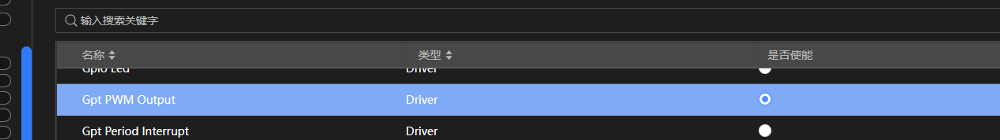

- 步骤二：选择要使能驱动模块，在配置界面配置驱动模块。

  

- 步骤三：在配置界面可以修改GPT驱动模块参数配置。

  

  核心代码如下：

- GPT初始化

   

- 封装例程

   

- 步骤四：如果需要串口打印就需配置以下操作。


- 步骤五：点击.jpg)编译代码，编译完成后，点击烧录代码。

#### 12.1.5实验结果

- 烧录成功后，打开串口工具，可以看到串口打印出来了写入UART0的数据，首先打印“GPT Continued Run begin”,GPIO5_2输出占空比40%的PWM波。

 

- 过10s后，串口打印“Change the duty to 50%”，GPIO5_2输出的PWM波的占空比改为50%，则实验成功。

  

#### 12.1.6扩展实验

本实验学习通过通用脉宽调制PWM-输出频率和占空比可配的PWM波，请学生做如下实验：

- 通过修改分频系数和计数器周期来改变PWM波频率，然后或查看其现象。


## 13、集成电路接口（I2C ）

### 13.1 配置I2C作为主机进行通信

#### 13.1.1实验目的

通过配置开发板的I2C控制器与外设AT24C64做通信，通过串口打印出通信信息。

#### 13.1.2实验要求

- 原理：I2C是双向通讯的，由两根线完成，分别是：SDA（串行数据线）、SCL（串行时钟线），接口输出模式为开漏输出，其总线接口已经集成到SOC内部，我们只需要通过原理图找到它的接口，在用外设的杜邦线或者其它方法连接到此接口上就可以实现I2C的通讯。

  SDA与SCL都外接了上拉电阻，所以当SDA空闲时刻输出的永远是高电平，它对外设也有一定要求，要求外设的输出模式也是开漏输出，因为这跟它本身的电路实现有关，若两个电路接口模式不一则是无法完成正常通讯的。

- 硬件要求：3061M核心板,AT24C64模块；

  
  
  
  
  
  
- 支持API版本、SDK版本：SolarA2 1.0.1.2及以上版本
  
- 支持IDE版本号：HiSpark Studio 1.0.0.8及以上版本

#### 13.1.3核心函数说明

13.1.3.1 HAL_I2C_MasterWriteBlocking()

| 定义：   | BASE_StatusType HAL_I2C_MasterWriteBlocking(I2C_Handle *handle, unsigned short devAddr, unsigned char *wData,unsigned int dataSize, unsigned int timeout) |
| -------- | ------------------------------------------------------------ |
| 功能：   | 主机以阻塞模式发送数据。                                     |
| 参数：   | handle：I2C句柄指针，详细请参考I2CI2C_Handle定义<br />devAddr：从属设备地址<br />wData要发送的数据缓冲区的地址：<br />dataSize：发送数据大小<br />timeout：超时时间。 |
| 返回值： | BASE status type                                             |
| 依赖：   | i2c.h                                                        |

13.1.3.2 HAL_I2C_MasterReadBlocking()

| 定义：   | BASE_StatusType HAL_I2C_MasterReadBlocking(I2C_Handle *handle, unsigned short devAddr, unsigned char *rData,unsigned int dataSize, unsigned int timeout) |
| -------- | ------------------------------------------------------------ |
| 功能：   | 主机以阻塞模式接收数据。                                     |
| 参数：   | handle：I2C句柄指针，详细请参考I2CI2C_Handle定义<br />devAddr：从属设备地址<br />rData：要接收的数据缓冲区的地址<br />dataSize：发送数据大小<br />timeout：超时时间 |
| 返回值： | BASE status type                                             |
| 依赖：   | i2c.h                                                        |

13.1.3.3 HAL_I2C_RegisterCallback()

| 定义：   | BASE_StatusType HAL_I2C_RegisterCallback(I2C_Handle *handle, I2C_CallbackId callbackID, I2C_CallbackFunType pcallback) |
| -------- | ------------------------------------------------------------ |
| 功能：   | 注册IIC中断函数                                              |
| 参数：   | handle：I2C句柄指针，详细请参考I2CI2C_Handle定义<br />callbackID：回调函数ID<br />pcallback：IIC中断服务函数名 |
| 返回值： | BASE status type                                             |
| 依赖：   | i2c.h                                                        |

13.1.3.4 HAL_I2C_MasterWriteIT()

| 定义：   | BASE_StatusType HAL_I2C_MasterWriteIT(I2C_Handle *handle, unsigned short devAddr,unsigned char *wData, unsigned int dataSize) |
| -------- | ------------------------------------------------------------ |
| 功能：   | 主机以中断模式发送数据                                       |
| 参数：   | handle：I2C句柄指针，详细请参考I2CI2C_Handle定义<br />devAddr：从属设备地址<br />wData要发送的数据缓冲区的地址：<br />dataSize：发送数据大小 |
| 返回值： | BASE status type                                             |
| 依赖：   | i2c.h                                                        |

13.1.3.5 HAL_I2C_MasterReadIT()

| 定义：   | BASE_StatusType HAL_I2C_MasterReadIT(I2C_Handle *handle, unsigned short devAddr,unsigned char *rData, unsigned int dataSize) |
| -------- | ------------------------------------------------------------ |
| 功能：   | 主机以中断模式接收数据                                       |
| 参数：   | handle：I2C句柄指针，详细请参考I2CI2C_Handle定义<br />devAddr：从属设备地址<br />rData：要接收的数据缓冲区的地址：<br />dataSize：发送数据大小 |
| 返回值： | BASE status type                                             |
| 依赖：   | i2c.h                                                        |

13.1.3.6 HAL_I2C_MasterWriteDMA()

| 定义：   | BASE_StatusType HAL_I2C_MasterWriteDMA(I2C_Handle *handle, unsigned short devAddr,unsigned char *wData, unsigned int dataSize) |
| -------- | ------------------------------------------------------------ |
| 功能：   | 主机以DMA模式发送数据                                        |
| 参数：   | handle：I2C句柄指针，详细请参考I2CI2C_Handle定义<br />devAddr：从属设备地址<br />dataSize：发送数据大小 |
| 返回值： | BASE status type                                             |
| 依赖：   | i2c.h                                                        |

13.1.3.7 HAL_I2C_MasterReadDMA()

| 定义：   | BASE_StatusType HAL_I2C_MasterReadDMA(I2C_Handle *handle, unsigned short devAddr,unsigned char *wData, unsigned int dataSize) |
| -------- | ------------------------------------------------------------ |
| 功能：   | 主机以DMA模式发送数据                                        |
| 参数：   | handle：I2C句柄指针，详细请参考I2CI2C_Handle定义<br />devAddr：从属设备地址<br />rData：要接收的数据缓冲区的地址：<br />dataSize：接收数据大小 |
| 返回值： | BASE status type                                             |
| 依赖：   | i2c.h                                                        |

#### 13.1.4实验流程

- 步骤一：点击配置器选择I2C Master Blocking AT24C64样例，并点击生成代码。

  

- 步骤二：选择要使能驱动模块，在配置界面配置驱动模块。

  

- 步骤三：在配置界面可以修改IIC驱动模块参数配置。

  

  核心代码如下：

- IIC初始化

   

- 主机向从机AT24C64读数据函数封装

   

- 主机向从机AT24C64写数据函数封装

   

- 封装例程

   

- 步骤四：如果需要串口打印就需配置以下操作。


- 步骤五：点击.jpg)编译代码，编译完成后，点击烧录代码。

- 步骤六：将AT24C64的SCL和SDA分别接入开发板的I2C0_SCL(GPIO4_2)、I2C0_SDA(GPIO4_3),然后接3.3V或者5V再接地。

   

#### 14.1.5实验结果

烧录成功后，打开串口工具，按一下开发板RESET按键复位开发板，可以看到串口打印出来了写入UART0的数据，可以看到开发板与AT24C64通信成功。

 

#### 14.1.6扩展实验

- 试着用中断进行IIC的接收和发送通信。


## 14、独立看门狗（IWDG）

### 14.1 验证看门狗复位功能

#### 14.1.1实验目的

- 通过设置开发板内的看门狗模块的窗口值和时间，在计数器减到窗口值还没喂狗，则复位复位，反之则不复位。


#### 14.1.2实验要求

- 原理：IWDG（独立看门狗）的工作原理主要基于一个12位的递减计数器，该计数器由一个独立的RC振荡器提供时钟信号。这个计数器在启动后会开始递减计数，当计数器的值递减到0时，就会触发一个复位信号，从而强制系统进行复位。然而，通过在计数器达到0之前对其进行“喂狗”操作（即重新加载计数器的值），可以避免产生复位信号，从而保持系统的正常运行。

- 硬件要求：3061M核心板；

  
  
- 支持API版本、SDK版本：SolarA2 1.0.1.2及以上版本
  
- 支持IDE版本号：HiSpark Studio 1.0.0.8及以上版本

#### 14.1.3核心函数说明

14.1.3.1 HAL_IWDG_Start()

| 定义：   | void HAL_IWDG_Start(IWDG_Handle *handle) |
| -------- | ---------------------------------------- |
| 功能：   | 开始IWDG计数                             |
| 参数：   | handle：IWDG句柄指针                     |
| 返回值： | None                                     |
| 依赖：   | iwdg.h                                   |

14.1.3.2 HAL_IWDG_Refresh()

| 定义：   | void HAL_IWDG_Refresh(IWDG_Handle *handle) |
| -------- | ------------------------------------------ |
| 功能：   | 刷新IWDG计数器(喂狗)                       |
| 参数：   | handle：IWDG句柄指针                       |
| 返回值： | None                                       |
| 依赖：   | iwdg.h                                     |

14.1.3.3 HAL_IWDG_SetWindowValueEx()

| 定义：   | void HAL_IWDG_SetWindowValueEx(IWDG_Handle *handle, unsigned int windowValue, IWDG_TimeType timeType) |
| -------- | ------------------------------------------------------------ |
| 功能：   | 设置IWDG计数器的窗口值。                                     |
| 参数：   | handle：IWDG句柄指针<br />windowValue：IWDG计数器的负载值<br />timeType：IWDG时间类型 |
| 返回值： | None                                                         |
| 依赖：   | iwdg_ex.h                                                    |

14.1.3.4 HAL_IWDG_SetTimeValue()

| 定义：   | void HAL_IWDG_SetTimeValue(IWDG_Handle *handle, unsigned int timeValue, IWDG_TimeType timeType) |
| -------- | ------------------------------------------------------------ |
| 功能：   | 设置计数时间值                                               |
| 参数：   | handle：IWDG句柄指针<br />timeValue：IWDG计数器的负载值<br />timeType：IWDG时间类型 |
| 返回值： | None                                                         |
| 依赖：   | iwdg.h                                                       |

14.1.3.5 HAL_IWDG_EnableWindowModeEx()

| 定义：   | void HAL_IWDG_EnableWindowModeEx(IWDG_Handle *handle) |
| -------- | ----------------------------------------------------- |
| 功能：   | 开启IWDGc窗口模式                                     |
| 参数：   | handle：IWDG句柄指针                                  |
| 返回值： | None                                                  |
| 依赖：   | iwdg_ex.h                                             |

#### 14.1.4实验流程

- 步骤一：点击配置器选择IWdg Refresh样例，并点击生成代码。

  

- 步骤二：选择要使能驱动模块，在配置界面配置驱动模块。

  

- 步骤三：在配置界面可以修改IWDG驱动模块参数配置。

  

  核心代码如下：

- IWDG初始化

  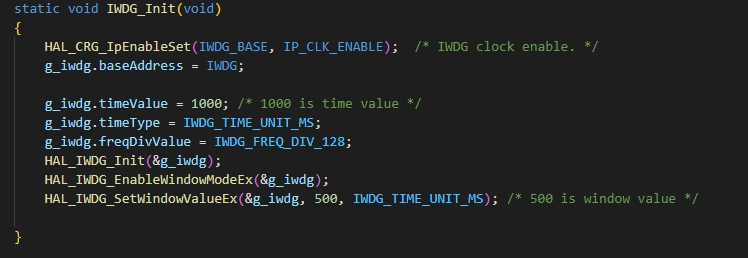 

- 封装例程

   

- 步骤四：如果需要串口打印就需配置以下操作。


- 步骤五：点击.jpg)编译代码，编译完成后，点击烧录代码。

#### 14.1.5实验结果

- 烧录成功后，打开串口工具，可以看到串口打印出来了写入UART0的数据.，可以看出程序开始“ START ：test iwdg sample”，喂一次狗输出一次“test iwdg sample”，可以看出通过不断的喂狗系统没有复位。


​     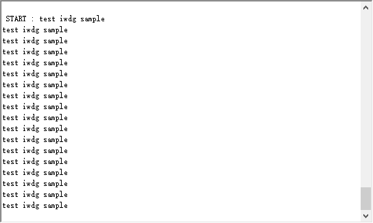 

- 当屏蔽HAL_IWDG_Refresh(&g_iwdg)函数时，取消喂狗，系统则会一直复位

​     

#### 14.1.6扩展实验

本实验学习通过配置IWDG参数，验证看门狗复位功能，软件进行喂狗操作，请学生做如下实验：

- 尝试设置窗口值，使其喂狗失败，查看其现象。


## 15、可编程增益放大器（PGA）

### 15.1 ADC采样PGA的输出电压

#### 15.1.1实验目的

- 测试PGA的放大电压功能，向PGA0_P0(GPIO2_5)注入0-3.3V的电压，并用ADC采样PGA的电压。


#### 15.1.2实验要求

- 原理：PGA（可编程增益放大器）‌是一种通用性很强的放大器，其放大倍数可以根据需要用程序进行控制，是A/D转换器的高性能模拟前端，主要用于放大输入到A/D装换器的信号,起到调节输入数据范围和隔离的作用。

- 硬件要求：3061M核心板；

  

#### 15.1.3核心函数说明

15.1.3.1 HAL_PGA_Init()

| 定义：   | BASE_StatusType HAL_PGA_Init(PGA_Handle *pgaHandle) |
| -------- | --------------------------------------------------- |
| 功能：   | 初始化PAG模块                                       |
| 参数：   | pgaHandle：PGA指针句柄                              |
| 返回值： | BASE status type：OK, ERROR.                        |
| 依赖：   | pga.h                                               |

15.1.3.2 HAL_PGA_SetGain()

| 定义：   | void HAL_PGA_SetGain(PGA_Handle *pgaHandle, PGA_GainValue gain) |
| -------- | ------------------------------------------------------------ |
| 功能：   | 设置PGA的增益值                                              |
| 参数：   | pgaHandle：PGA指针句柄<br />gain：放大的倍数值，详细参考PGA_GainValue |
| 返回值： | None                                                         |
| 依赖：   | pga.h                                                        |

15.1.3.3 HAL_PGA_Start()

| 定义：   | void HAL_PGA_Start(PGA_Handle *pgaHandle) |
| -------- | ----------------------------------------- |
| 功能：   | 启用PGA                                   |
| 参数：   | pgaHandle：PGA指针句柄                    |
| 返回值： | None                                      |
| 依赖：   | pga.h                                     |

15.1.3.4 HAL_PGA_Stop()

| 定义：   | void HAL_PGA_Start(PGA_Handle *pgaHandle) |
| -------- | ----------------------------------------- |
| 功能：   | 停用PGA                                   |
| 参数：   | pgaHandle：PGA指针句柄                    |
| 返回值： | None                                      |
| 依赖：   | pga.h                                     |

#### 15.1.4实验流程

- 步骤一：点击配置器选择Pga Result Sampling样例，并点击生成代码。

  

- 步骤二：选择要使能驱动模块，在配置界面配置驱动模块。

  

- 步骤三：在配置界面可以修改PGA驱动模块参数配置。

  

  核心代码如下：

- PGA初始化

   

- ADC初始化

   

- 封装例程

   

- 步骤四：如果需要串口打印就需配置以下操作。


- 步骤五：点击.jpg)编译代码，编译完成后，点击烧录代码。

- 步骤六：设置数字电源的电压，设为1.4V。

   

- 步骤七：将PGA0_P0(GPIO2_5)接数字电源正极，数字电源负极接地。

   

#### 15.1.5实验结果

- 烧录成功后，打开串口工具，按一下开发板RESET按键复位开发板，可以看到串口打印出来了写入UART0的数据，可以看出1.4V被放大2倍，证明实验成功。


​      

#### 15.1.6扩展实验

本实验学习通过运放的基本使用 - ADC采样PGA的输出电压，请学生做如下实验：

- 改变增益放大值，改为x4、x8、x16查看其放大后的电压。


## 16、电源控制（PMC）

### 16.1 PMC模块的定时唤醒实验

#### 16.1.1实验目的

- 测试PMC模块的睡眠模式，进入睡眠模式后，通过定时唤醒方式实现对深度睡眠唤醒，唤醒后串口打印消息。


#### 16.1.2实验要求

- 原理：PMC模块的定时唤醒功能通过内置的定时器实现，这些定时器可以根据用户需求进行设置，并在达到预设时间后触发PMC的唤醒或执行相应的操作。通过对内部电源的管理，实现上下电时序、开关机功能、低功耗模式切换和掉电检测。

- 硬件要求：3061M核心板；

  
  
- 支持API版本、SDK版本：SolarA2 1.0.1.2及以上版本
  
- 支持IDE版本号：HiSpark Studio 1.0.0.8及以上版本

#### 16.1.3核心函数说明

16.1.3.1 HAL_PMC_GetWakeupType()

| 定义：   | PMC_LowpowerType HAL_PMC_GetWakeupType(PMC_Handle *handle) |
| -------- | ---------------------------------------------------------- |
| 功能：   | 获取唤醒源                                                 |
| 参数：   | handle：PMC handle                                         |
| 返回值： | PMC_LowpowerType 类型变量                                  |
| 依赖：   | pmc.h                                                      |

16.1.3.2 HAL_PMC_EnterDeepSleepMode()

| 定义：   | void HAL_PMC_EnterDeepSleepMode(PMC_Handle *handle) |
| -------- | --------------------------------------------------- |
| 功能：   | 进入深度睡眠界面                                    |
| 参数：   | handle：PMC handle                                  |
| 返回值： | None                                                |
| 依赖：   | pmc.h                                               |

16.1.3.3 HAL_PMC_EnterSleepMode()

| 定义：   | void HAL_PMC_EnterSleepMode(void) |
| -------- | --------------------------------- |
| 功能：   | 进入睡眠界模式                    |
| 参数：   | void                              |
| 返回值： | None                              |
| 依赖：   | pmc.h                             |

#### 16.1.4实验流程

- 步骤一：点击配置器选择Pmc wakeup sample样例，并点击生成代码。

  

- 步骤二：选择要使能驱动模块，在配置界面配置驱动模块。

  

- 步骤三：在配置界面可以修改PMC驱动模块参数配置。

  

  核心代码如下：

- PMC初始化

   

- 深度睡眠被唤醒后进行的操作

   

- 封装例程

   

- 步骤四：如果需要串口打印就需配置以下操作。

  

- 步骤五：点击.jpg)编译代码，编译完成后，点击烧录代码。

#### 16.1.5实验结果

- 烧录成功后，打开串口工具，可以看到串口打印出来了写入UART0的数据,程序进入死循环，串口打印“Enter deep sleep mode”进入深入睡眠模式，经过设定的唤醒时间后，会唤醒程序复位重新运行，串口会打印"wakeup from deepsleep“程序继续循环。证明实验成功


​      

#### 16.1.6扩展实验

本实验学习配置PMC模块的定时唤醒功能，实现对深度睡眠的唤醒，请学生做如下实验：

- 改写设定唤醒时间，查看其现象。


## 17、通用异步收发传输器（UART ）

### 17.1 UART-环回通信实验

#### 17.1.1实验目的

- 测试开发板UART控制器的中断发送接收功能，与终端做相互通信。


#### 17.1.2实验要求

- 原理：‌UART（通用异步收发传输器）是一种异步串行通信协议，它使用两根线（一根发送，一根接收）进行全双工通信。UART通信是异步的，意味着数据的发送和接收不需要一个持续的时钟信号来同步，而是通过特定的起始、数据、停止位来进行数据的发送和接收。

- 硬件要求：3061M核心板；

  
  
- 支持API版本、SDK版本：SolarA2 1.0.1.2及以上版本
  
- 支持IDE版本号：HiSpark Studio 1.0.0.8及以上版本

#### 17.1.3核心函数说明

17.1.3.1 HAL_UART_ReadIT()

| 定义：   | BASE_StatusType HAL_UART_ReadIT(UART_Handle *uartHandle, unsigned char *saveData, unsigned int dataLength) |
| :------- | ------------------------------------------------------------ |
| 功能：   | 在中断模式下接收数据。                                       |
| 参数：   | uartHandle：UART参数句柄指针<br />saveData：要保存的数据缓冲区的地址<br />dataLength：存储缓冲区中的数据长度 |
| 返回值： | BASE status type：OK, ERROR, BUSY, TIMEOUT                   |
| 依赖：   | uart.h                                                       |

17.1.3.2 HAL_UART_WriteIT()

| 定义：   | BASE_StatusType HAL_UART_WriteIT(UART_Handle *uartHandle, unsigned char *srcData, unsigned int dataLength) |
| -------- | ------------------------------------------------------------ |
| 功能：   | 在中断模式下接收数据。                                       |
| 参数：   | uartHandle：UART参数句柄指针<br />srcData：要发送的数据缓冲区的地址<br />dataLength：存储缓冲区中的数据长度 |
| 返回值： | BASE status type：OK, ERROR, BUSY, TIMEOUT                   |
| 依赖：   | uart.h                                                       |

17.1.3.3 HAL_UART_RegisterCallBack()

| 定义：   | BASE_StatusType HAL_UART_RegisterCallBack(UART_Handle *uartHandle, UART_CallbackFun_Type typeID,UART_CallbackType pCallback) |
| -------- | ------------------------------------------------------------ |
| 功能：   | 用户回调函数注册界面。                                       |
| 参数：   | uartHandle：UART参数句柄指针<br />typeID：回调函数类型的Id<br />pCallback：指定callbcak函数的指针 |
| 返回值： | BASE_StatusType：OK, ERROR.                                  |
| 依赖：   | uart.h                                                       |

17.1.3.4 HAL_UART_GetState()

| 定义：   | UART_State_Type HAL_UART_GetState(UART_Handle *uartHandle) |
| -------- | ---------------------------------------------------------- |
| 功能：   | 获取UART当前状态                                           |
| 参数：   | uartHandle：UART参数句柄指针                               |
| 返回值： | UART的状态                                                 |
| 依赖：   | uart.h                                                     |

17.1.3.5 HAL_UART_WriteBlocking()

| 定义：   | BASE_StatusType HAL_UART_WriteBlocking(UART_Handle *uartHandle, unsigned char *srcData,unsigned int dataLength, unsigned int blockingTime) |
| -------- | ------------------------------------------------------------ |
| 功能：   | UART阻塞模式发送数据                                         |
| 参数：   | uartHandle：UART参数句柄指针<br />srcData：要发送的数据缓冲区的地址<br />dataLength：存储缓冲区中的数据长度<br />blockingTime：超时时间 |
| 返回值： | BASE status type：OK, ERROR, BUSY, TIMEOUT.                  |
| 依赖：   | uart.h                                                       |

17.1.3.6 HAL_UART_ReadBlocking()

| 定义：   | BASE_StatusType HAL_UART_ReadBlocking(UART_Handle *uartHandle, unsigned char *saveData,unsigned int dataLength, unsigned int blockingTime) |
| -------- | ------------------------------------------------------------ |
| 功能：   | UART阻塞模式接收数据                                         |
| 参数：   | uartHandle：UART参数句柄指针<br />saveData：要保存的数据缓冲区的地址<br />dataLength：存储缓冲区中的数据长度<br />blockingTime：超时时间 |
| 返回值： | BASE status type：OK, ERROR, BUSY, TIMEOUT.                  |
| 依赖：   | uart.h                                                       |

#### 17.1.4实验流程

- 步骤一：点击配置器选择Uart Interrupt Tx after Rx样例，并点击生成代码。

  

- 步骤二：选择要使能驱动模块，在配置界面配置驱动模块。

  

- 步骤三：在配置界面可以修改UART驱动模块参数配置。

  

  

  核心代码如下：

- UART初始化

   

- UART的接收和发送中断

   

- 计算接收缓冲区的长度和清空接收缓存区

  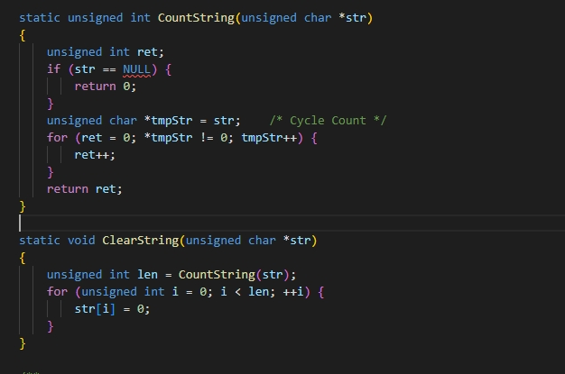 

- 封装例程

   

- 步骤四：点击.jpg)编译代码，编译完成后，点击烧录代码。

#### 17.1.5实验结果

- 烧录成功后，打开串口工具，按一下开发板RESET按键复位开发板，可以看到串口打印出来了写入UART0的数据,串口打印“UART Init finish, please enter characters(length no more than 10)：”后，在串口调试助手发送“hello!!!”给开发板，最后开发板发送回电脑端打印出“Read Finish：hello!!!     Write Finish”。证明实验成功。


​       

#### 17.1.6扩展实验

本实验学习 UART-中断模式下环回发送数据，请学生做如下实验：

- 有两开发板的话，试着两个开发板相互通信，通过串口通信。


### 17.2 UART不同模式下的通信

#### 17.2.1实验目的

- 通过配置开发板UART控制器，通过DMA搬运发送数据给中断，再通过中断接收数据。


#### 17.2.2实验要求

- 原理：UART_DMA（串行通信总线DMA传输）是指在微控制器（MCU）上使用通用异步收发传输器（UART）和直接内存访问（DMA）控制器进行数据传输的方法。UART用于串行通信，而DMA用于在不占用CPU资源的情况下进行高速数据传输。

- 硬件要求：3061M核心板；

  
  
- 支持API版本、SDK版本：SolarA2 1.0.1.2及以上版本
  
- 支持IDE版本号：HiSpark Studio 1.0.0.8及以上版本

#### 17.2.3核心函数说明

17.2.3.1 HAL_UART_WriteDMA()

| 定义：   | BASE_StatusType HAL_UART_WriteDMA(UART_Handle *uartHandle, unsigned char *srcData,  unsigned int dataLength) |
| :------- | ------------------------------------------------------------ |
| 功能：   | 在DMA模式发送数据                                            |
| 参数：   | uartHandle：UART参数句柄指针<br />srcData：要发送的数据缓冲区的地址<br />dataLength：要发送的数据大小 |
| 返回值： | BASE status type：OK, ERROR, BUSY, TIMEOUT                   |
| 依赖：   | uart.h                                                       |

17.2.3.2 HAL_UART_ReadDMA()

| 定义：   | BASE_StatusType HAL_UART_ReadDMA(UART_Handle *uartHandle, unsigned char *saveData,unsigned int dataLength) |
| :------- | ------------------------------------------------------------ |
| 功能：   | 在DMA模式接收数据。                                          |
| 参数：   | uartHandle：UART参数句柄指针<br />saveData：要保存的数据缓冲区的地址<br />dataLength：存储缓冲区中的数据长度 |
| 返回值： | BASE status type：OK, ERROR, BUSY, TIMEOUT                   |
| 依赖：   | uart.h                                                       |

17.2.3.3 HAL_UART_ReadDMAAndCyclicallyStored()

| 定义：   | BASE_StatusType HAL_UART_ReadDMAAndCyclicallyStored(UART_Handle *uartHandle, unsigned char *saveData,DMA_LinkList *tempNode, unsigned int dataLength) |
| :------- | ------------------------------------------------------------ |
| 功能：   | UART DAM（rx到内存）将数据循环存储到指定内存（saveData）。   |
| 参数：   | uartHandle：UART参数句柄指针<br />saveData：要保存的数据缓冲区的地址<br />tempNode：DMA链路列表<br />dataLength：存储缓冲区中的数据长度 |
| 返回值： | BASE status type：OK, ERROR, BUSY, TIMEOUT                   |
| 依赖：   | uart.h                                                       |

17.2.3.4 HAL_UART_ReadDMAGetPos()

| 定义：   | unsigned int HAL_UART_ReadDMAGetPos(UART_Handle *uartHandle) |
| :------- | ------------------------------------------------------------ |
| 功能：   | 获取DMA传输地址相对于指定内存的偏移地址                      |
| 参数：   | uartHandle：UART参数句柄指针                                 |
| 返回值： | 指定内存的偏移值                                             |
| 依赖：   | uart.h                                                       |

#### 17.2.4实验流程

- 步骤一：点击配置器选择Uart DMA Tx&Int Rx Simultaneously样例，并点击生成代码。

  

- 步骤二：选择要使能驱动模块，在配置界面配置驱动模块。

  

- 步骤三：在配置界面可以修改UART驱动模块参数配置。

  

  核心代码如下：

- UART初始化

   

- DMA初始化

   

- 中断接收服务函数，DMA发送函数

   

- 封装例程

   

- 步骤四：点击.jpg)编译代码，编译完成后，点击烧录代码。

#### 17.2.5实验结果

- 烧录成功后，打开串口工具，按一下开发板RESET按键复位开发板，可以看到串口打印出来了写入UART0的数据,开发板不断的进行UART_DMA发送“write_finish 123456789012345”,在串口调试助手发送数据，开发板串口中断接收数据并打印。证明实验成功。


  

#### 17.2.6扩展实验

本实验学习 UART-Tx在DMA模式下发送数据Rx在中断模式下接收数据，请学生做如下实验：

- 尝试UART-Tx在中断模式下发送数据Rx在DMA模式下接收数据。

  

## 18、 模数转换器（ADC）

### 18.1  ADC的单次采样实验

#### 18.1.1实验目的

配置开发板的ADC模块，使用软件触发ADC采样，采样GPIO0_5的电压，采样结束后触发DMA搬运结果。搬运结束产生中断，在ADC的DMA完成回调函数中读出结果。

#### 18.1.2实验要求

- 原理：‌**ADC**‌（模数转换器）是将模拟信号转换为数字信号的设备。它的基本工作原理包括‌[采样](https：//www.baidu.com/s?rsv_idx=1&wd=采样&fenlei=256&usm=5&ie=utf-8&rsv_pq=dbeebec200edd8a2&oq=ADC原理&rsv_t=7a32zwvyXvd90SKrPo8%2BRbxYYSAf45mmuf1AcpnNjKlTpCi%2FEJZVi%2B6hBJQ&sa=re_dqa_generate)、保持、‌[量化](https：//www.baidu.com/s?rsv_idx=1&wd=量化&fenlei=256&usm=5&ie=utf-8&rsv_pq=dbeebec200edd8a2&oq=ADC原理&rsv_t=1918Y8g70q7Qv2DiqjCWgxcvsRN4i7YKC2AhrTy0oR5wc93ygOEhoZs8Prs&sa=re_dqa_generate)和‌[编码](https：//www.baidu.com/s?rsv_idx=1&wd=编码&fenlei=256&usm=5&ie=utf-8&rsv_pq=dbeebec200edd8a2&oq=ADC原理&rsv_t=1918Y8g70q7Qv2DiqjCWgxcvsRN4i7YKC2AhrTy0oR5wc93ygOEhoZs8Prs&sa=re_dqa_generate)四个步骤。采样是将连续时间信号变成离散时间信号的过程；保持是将采样得到的信号保持在一个恒定的电压水平；量化是将连续的模拟信号离散化，将其分为不同的等级；编码则是将量化后的等级转换为二进制代码。

- 硬件要求：3061M核心板；

  
  
- 工具：数字电源
  
- 支持API版本、SDK版本：SolarA2 1.0.1.2及以上版本
  
- 支持IDE版本号：HiSpark Studio 1.0.0.8及以上版本

#### 18.1.3核心函数说明

18.1.3.1 HAL_ADC_StartDma()

| 定义：   | BASE_StatusType HAL_ADC_StartDma(ADC_Handle *adcHandle, unsigned int startSoc,   unsigned int endSoc, unsigned int *saveData) |
| :------- | ------------------------------------------------------------ |
| 功能：   | 启动ADC转换并启用ADC DMA。使用DMA完成SOC转换后，使用DMA可以传输连续SOC的采样结果。DMA传输的开始和结束由startSoc和endSoc决定。 |
| 参数：   | adcHandle：ADC参数句柄指针<br />startSoc：DMA传输的第一个SOC结果<br />endSoc：DMA传输的最后SOC结果<br />saveData：保存转换结果的地址 |
| 返回值： | BASE status type：OK, ERROR.                                 |
| 依赖：   | adc.h                                                        |

18.1.3.2 HAL_ADC_Init()

| 定义：   | BASE_StatusType HAL_ADC_Init(ADC_Handle *adcHandle)          |
| :------- | ------------------------------------------------------------ |
| 功能：   | 初始化ADC硬件控制器。控制器初始化后，ADC采样后来至少触发了100次。 |
| 参数：   | adcHandle：ADC参数句柄指针                                   |
| 返回值： | BASE status type：OK, ERROR                                  |
| 依赖：   | adc.h                                                        |

18.1.3.3 HAL_ADC_SoftTrigSample()

| 定义：   | BASE_StatusType HAL_ADC_SoftTrigSample(ADC_Handle *adcHandle, unsigned int soc) |
| :------- | ------------------------------------------------------------ |
| 功能：   | ADC单通道软件触发采样                                        |
| 参数：   | adcHandle：ADC参数句柄指针<br />soc：SOC的配置ID，触发参数   |
| 返回值： | BASE status type：OK, ERROR.                                 |
| 依赖：   | adc.h                                                        |

18.1.3.4 HAL_ADC_GetConvResult()

| 定义：   | unsigned int HAL_ADC_GetConvResult(ADC_Handle *adcHandle, unsigned int soc) |
| :------- | ------------------------------------------------------------ |
| 功能：   | ADC读取采样/转换结果                                         |
| 参数：   | adcHandle：ADC参数句柄指针<br />soc：SOC的配置ID             |
| 返回值： | 采样/转换结果                                                |
| 依赖：   | adc.h                                                        |

18.1.3.5 HAL_ADC_CheckSocFinish()

| 定义：   | BASE_StatusType HAL_ADC_CheckSocFinish(ADC_Handle *adcHandle, unsigned int soc) |
| :------- | ------------------------------------------------------------ |
| 功能：   | 检查ADC中是否完成采样转换                                    |
| 参数：   | adcHandle：ADC参数句柄指针<br />soc：SOC的配置ID，触发参数   |
| 返回值： | BASE_STATUS_ERROR   BASE_STATUS_OK                           |
| 依赖：   | adc.h                                                        |

18.1.3.6 HAL_ADC_ConfigureSoc()

| 定义：   | BASE_StatusType HAL_ADC_ConfigureSoc(ADC_Handle *adcHandle, ADC_SOCNumber soc, SOC_Param *socParam) |
| :------- | ------------------------------------------------------------ |
| 功能：   | ADC配置SOC                                                   |
| 参数：   | adcHandle：ADC参数句柄指针<br />socParam：SOC的参数结构，这与外围电路设计有关 |
| 返回值： | BASE status type：OK, ERROR.                                 |
| 依赖：   | adc.h                                                        |

18.1.3.7 HAL_ADC_SoftTrigMultiSample()

| 定义：   | BASE_StatusType HAL_ADC_SoftTrigMultiSample(ADC_Handle *adcHandle, ADC_SoftMultiTrig syncTrig) |
| :------- | ------------------------------------------------------------ |
| 功能：   | ADC配置SOC                                                   |
| 参数：   | adcHandle：ADC参数句柄指针<br />soc：SOC的配置ID，触发参数   |
| 返回值： | BASE status type：OK, ERROR.                                 |
| 依赖：   | adc.h                                                        |

#### 18.1.4实验流程

- 步骤一：点击配置器选择Adc Singletrigger Dma样例，并点击生成代码。

  

- 步骤二：选择要使能驱动模块，在配置界面配置驱动模块。

  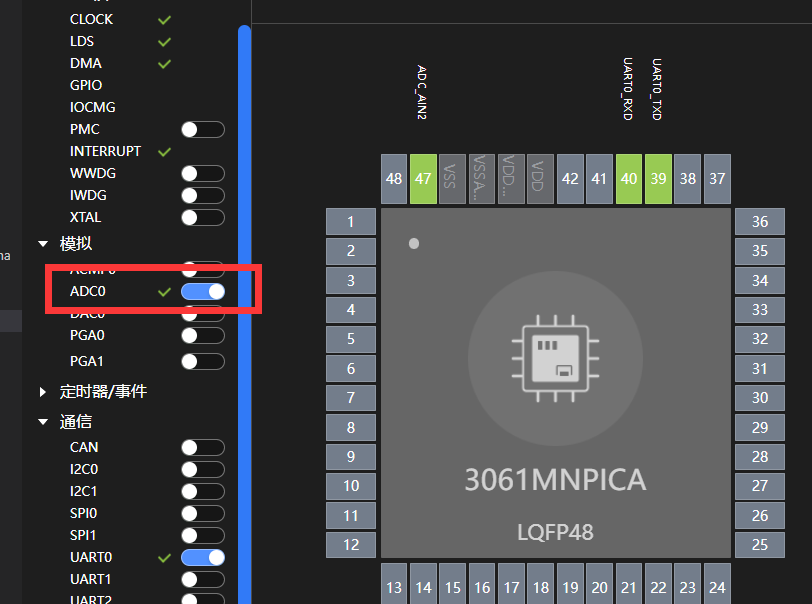

- 步骤三：在配置界面可以修改ADC驱动模块参数配置。

  

  核心代码如下：

- ADC初始化

   

- DMA初始化

   

- DMA搬运完成触发ADC回调函数

   

- 封装例程

   

- 步骤四：如果需要串口打印就需配置以下操作。


- 步骤五：点击.jpg)编译代码，编译完成后，点击烧录代码。

- 步骤六：设置数字电源的电压，设为2.4V。

   

- 步骤七：开发板ADC_AIN2(GPIO0_5)连接数字电源正极、数字电源负极接地。

   

#### 18.1.5实验结果

烧录成功后，向ADC_AIN2(GPIO0_5)输入电压来检测ADC采样电压，此次测试ADC_AIN2(GPIO0_5)接入2.4V电压，打开串口工具，按一下开发板RESET按键复位开发板，可以看到串口打印出来了写入UART0的数据,最后测量出电压值“voltage：2.39363”，在正常误差内，证明实验成功。

 

#### 18.1.6扩展实验

本实验学习 配置ADC的单次采样功能，利用DMA搬运结果，请学生做如下实验：

- 尝试用中断回调读取ADC采样结果。


### 18.2单次触发ADC，产生连续的采样效果

#### 18.2.1实验目的

- 配置开发板的ADC模块，使用软件触发ADC开始采样，采样GPIO0_5的电压，采样结束后触发ADC中断，并在中断回调函数中读取ADC转换结果。在每次完成采样结束后，内部会自动产生触发请求，实现连续采样功能。


#### 18.2.2实验要求

- 原理：‌**ADC**‌（模数转换器）是将模拟信号转换为数字信号的设备。它的基本工作原理包括‌[采样](https：//www.baidu.com/s?rsv_idx=1&wd=采样&fenlei=256&usm=5&ie=utf-8&rsv_pq=dbeebec200edd8a2&oq=ADC原理&rsv_t=7a32zwvyXvd90SKrPo8%2BRbxYYSAf45mmuf1AcpnNjKlTpCi%2FEJZVi%2B6hBJQ&sa=re_dqa_generate)、保持、‌[量化](https：//www.baidu.com/s?rsv_idx=1&wd=量化&fenlei=256&usm=5&ie=utf-8&rsv_pq=dbeebec200edd8a2&oq=ADC原理&rsv_t=1918Y8g70q7Qv2DiqjCWgxcvsRN4i7YKC2AhrTy0oR5wc93ygOEhoZs8Prs&sa=re_dqa_generate)和‌[编码](https：//www.baidu.com/s?rsv_idx=1&wd=编码&fenlei=256&usm=5&ie=utf-8&rsv_pq=dbeebec200edd8a2&oq=ADC原理&rsv_t=1918Y8g70q7Qv2DiqjCWgxcvsRN4i7YKC2AhrTy0oR5wc93ygOEhoZs8Prs&sa=re_dqa_generate)四个步骤。采样是将连续时间信号变成离散时间信号的过程；保持是将采样得到的信号保持在一个恒定的电压水平；量化是将连续的模拟信号离散化，将其分为不同的等级；编码则是将量化后的等级转换为二进制代码。

- 硬件要求：3061M核心板；

  
  
- 支持API版本、SDK版本：SolarA2 1.0.1.2及以上版本
  
- 支持IDE版本号：HiSpark Studio 1.0.0.8及以上版本

#### 18.2.3核心函数说明

18.2.3.1 HAL_ADC_StartIt()

| 定义：   | BASE_StatusType HAL_ADC_StartIt(ADC_Handle *adcHandle) |
| :------- | ------------------------------------------------------ |
| 功能：   | ADC使能中断                                            |
| 参数：   | adcHandle：ADC参数句柄指针                             |
| 返回值： | BASE status type：OK, ERROR.                           |
| 依赖：   | adc.h                                                  |

18.2.3.2 HAL_ADC_RegisterCallBack()

| 定义：   | void HAL_ADC_RegisterCallBack(ADC_Handle *adcHandle, ADC_CallbackFunType typeID, ADC_CallbackType pCallback) |
| :------- | ------------------------------------------------------------ |
| 功能：   | ADC使能中断                                                  |
| 参数：   | adcHandle：ADC参数句柄指针<br />typeID：回调函数类型的Id<br />pCallback：指定callbcak函数的指针 |
| 返回值： | None。                                                       |
| 依赖：   | adc.h                                                        |

18.2.3.3 HAL_ADC_IrqHandlerOver()

| 定义：   | void HAL_ADC_IrqHandlerOver(void *handle) |
| :------- | ----------------------------------------- |
| 功能：   | ADC溢出中断服务函数                       |
| 参数：   | adcHandle：ADC参数句柄指针                |
| 返回值： | void                                      |
| 依赖：   | adc.h                                     |

#### 18.2.4实验流程

- 步骤一：点击配置器选择Adc Continuetrigger样例，并点击生成代码。

  

- 步骤二：选择要使能驱动模块，在配置界面配置驱动模块。

  

- 步骤三：在配置界面可以修改CFD驱动模块参数配置。

  

  核心代码如下：

- ADC初始化

   

- ADC中断回调函数

   

- 封装例程

   

- 步骤四：如果需要串口打印就需配置以下操作。


- 步骤五：点击.jpg)编译代码，编译完成后，点击烧录代码。

- 步骤六：设置数字电源的电压，设为2.4V。

   

- 步骤七：开发板ADC_AIN2(GPIO0_5)连接数字电源正极、数字电源负极接地。

   

#### 18.2.5实验结果

- 烧录成功后，向ADC_AIN2(GPIO0_5)输入电压来检测ADC采样电压，此次测试ADC_AIN2(GPIO0_5)接入2.4V电压，打开串口工具，可以看到串口一直打印出来出电压值，在正常误差内，证明实验成功。

​      


#### 18.2.6扩展实验

本实验学习单次触发ADC，可以产生连续的采样效果，请学生做如下实验：

- 尝试用DMA搬运ADC采样结果


## 19、基本定时器（ TIMER）

### 19.1周期为1秒的定时器

#### 19.1.1实验目的

- 测试开发板的定时器的定时中断功能，每秒产生一次中断，然后中断中串口打印。


#### 19.1.2实验要求

- 原理：基于时钟信号源提供稳定的时钟信号作为计时器的基准。计数器从预设值开始减计数，每当时钟信号到达时计数器递减。当计数器达到0时，定时器会触发一个中断信号通知中断控制器处理相应的中断服务程序，从而执行预定的操作。

- 硬件要求：3061M核心板；

  
  
- 支持API版本、SDK版本：SolarA2 1.0.1.2及以上版本
- 支持IDE版本号：HiSpark Studio 1.0.0.8及以上版本

#### 19.1.3核心函数说明

19.1.3.1 HAL_TIMER_Config()

| 定义：   | BASE_StatusType HAL_TIMER_Config(TIMER_Handle *handle, TIMER_CFG_TYPE cfgType) |
| :------- | ------------------------------------------------------------ |
| 功能：   | 配置定时器                                                   |
| 参数：   | handle：Timer参数句柄指针<br />cfgType：定时器配置           |
| 返回值： | BASE_STATUS_OK   BASE_STATUS_ERROR                           |
| 依赖：   | timer.h                                                      |

19.1.3.2 HAL_TIMER_Init()

| 定义：   | BASE_StatusType HAL_TIMER_Init(TIMER_Handle *handle) |
| :------- | ---------------------------------------------------- |
| 功能：   | TIME模块初始化                                       |
| 参数：   | handle：Timer 参数句柄指针                           |
| 返回值： | BASE_STATUS_OK   BASE_STATUS_ERROR                   |
| 依赖：   | timer.h                                              |

19.1.3.3 HAL_TIMER_GetConfig()

| 定义：   | BASE_StatusType HAL_TIMER_GetConfig(TIMER_Handle *handle) |
| :------- | --------------------------------------------------------- |
| 功能：   | 获取TIMER的配置参数                                       |
| 参数：   | handle：Timer 参数句柄指针                                |
| 返回值： | BASE_STATUS_OK   BASE_STATUS_ERROR                        |
| 依赖：   | timer.h                                                   |

19.1.3.4 HAL_TIMER_Start()

| 定义：   | void HAL_TIMER_Start(TIMER_Handle *handle) |
| :------- | ------------------------------------------ |
| 功能：   | 启动TIMER计数                              |
| 参数：   | handle：Timer 参数句柄指针                 |
| 返回值： | None                                       |
| 依赖：   | timer.h                                    |

#### 19.1.4实验流程

- 步骤一：点击配置器选择Timer Interrupt样例，并点击生成代码。

  

- 步骤二：选择要使能驱动模块，在配置界面配置驱动模块。

  

- 步骤三：在配置界面可以修改TIMER驱动模块参数配置。

  

  核心代码如下：

- TIMER初始化

   

- TIMER中断服务函数

   

- 封装例程

   

- 步骤四：如果需要串口打印就需配置以下操作。


- 步骤五：点击.jpg)编译代码，编译完成后，点击烧录代码。

#### 19.1.5实验结果

- 烧录成功后，打开串口工具，按一下开发板RESET按键复位开发板，可以看到串口打印出来了写入UART0的数据,打印“TIMER_SampleMain begin”，定时器开启，然后1s触发一次定时器中断，打印“In interrupt”，10秒后，打印“Change period of timer”改变定时器周期，改为0.5s触发一次定时器中断，证明实验成功。

​      

#### 19.1.6扩展实验

本实验学习配置周期为1秒的定时器，请学生做如下实验：

- 配置周期为2秒的定时器，10秒后改周期为1秒。


## 20、同步串行外接接口（SPI）

### 20.1 SPI使用阻塞方式进行主从通信

#### 20.1  .1实验目的

- 配置开发板的SPI控制器，一个配置主机模式，一个配置从机模式，通过阻塞方式实现两个开发板通信。


#### 20.1.2实验要求

- 原理：SPI是一种高速、全双工、同步的通信总线。它使用四根线进行通信：串行时钟线（‌[SCK](https：//www.baidu.com/s?rsv_idx=1&wd=SCK&fenlei=256&usm=2&ie=utf-8&rsv_pq=c75fda3e020e1720&oq=spi原理&rsv_t=75c06nCXNfJjbIxZ3PpLIfBHVlFtnOHtEz7magED0y9UUo9WwbsTuutdFRY&sa=re_dqa_generate)）、主机输入/从机输出数据线（‌[MISO](https：//www.baidu.com/s?rsv_idx=1&wd=MISO&fenlei=256&usm=2&ie=utf-8&rsv_pq=c75fda3e020e1720&oq=spi原理&rsv_t=b8b6%2FlOR5xcgbIipPZdPnMxLsiwdllxUWPWoSc%2FRotd%2FDiqUsM%2FSktjImtA&sa=re_dqa_generate)）、主机输出/从机输入数据线（MOSI）和低电平有效的从机选择线（‌[CS](https：//www.baidu.com/s?rsv_idx=1&wd=CS&fenlei=256&usm=2&ie=utf-8&rsv_pq=c75fda3e020e1720&oq=spi原理&rsv_t=b8b6%2FlOR5xcgbIipPZdPnMxLsiwdllxUWPWoSc%2FRotd%2FDiqUsM%2FSktjImtA&sa=re_dqa_generate)）。SPI通信协议允许一个主设备启动与一个或多个从设备的同步通信，完成数据的交换。主设备通过SCK提供时钟脉冲，MISO和MOSI用于数据的串行传输。

- 硬件要求：两个3061M核心板；

  
  
- 支持API版本、SDK版本：SolarA2 1.0.1.2及以上版本
  
- 支持IDE版本号：HiSpark Studio 1.0.0.8及以上版本

#### 20.1.3核心函数说明

20.1.3.1 HAL_SPI_WriteBlocking()

| 定义：   | BASE_StatusType HAL_SPI_WriteBlocking(SPI_Handle *handle, unsigned char *wData,unsigned int dataSize,unsigned int timeout) |
| :------- | ------------------------------------------------------------ |
| 功能：   | 以阻塞模式发送数据。                                         |
| 参数：   | handle：SPI handle<br />wData：要发送的数据缓冲区的地址<br />dataSize：要发送的数据数量<br />timeout：超时时间，单位：毫秒 |
| 返回值： | BASE status type：OK, ERROR, BUSY, TIMEOUT.                  |
| 依赖：   | spi.h                                                        |

20.1.3.2 HAL_SPI_ReadBlocking()

| 定义：   | BASE_StatusType HAL_SPI_ReadBlocking(SPI_Handle *handle,unsigned char *rData,unsigned int dataSize,unsigned int timeout) |
| :------- | ------------------------------------------------------------ |
| 功能：   | 以阻塞模式接收数据。                                         |
| 参数：   | handle：SPI handle<br />rData：要接收的数据缓冲区的地址<br />dataSize：要接收的数据数量<br />timeout：超时时间，单位：毫秒 |
| 返回值： | BASE status type：OK, ERROR, BUSY, TIMEOUT.                  |
| 依赖：   | spi.h                                                        |

20.1.3.3 HAL_SPI_WriteReadBlocking()

| 定义：   | BASE_StatusType HAL_SPI_WriteReadBlocking(SPI_Handle *handle,unsigned char *rData,unsigned char *wData,unsigned int dataSize,unsigned int timeout) |
| :------- | ------------------------------------------------------------ |
| 功能：   | 以阻塞模式接收和发送数据。                                   |
| 参数：   | handle：SPI handle<br />rData：要接收的数据缓冲区的地址<br />wData：要发送的数据缓冲区的地址<br />dataSize：要接收和发送的数据数量<br />timeout：超时时间，单位：毫秒 |
| 返回值： | BASE status type：OK, ERROR, BUSY, TIMEOUT.                  |
| 依赖：   | spi.h                                                        |

20.1.3.4 HAL_SPI_ChipSelectChannelSet()

| 定义：   | BASE_StatusType HAL_SPI_ChipSelectChannelSet(SPI_Handle *handle, SPI_ChipSelectChannel channel) |
| :------- | ------------------------------------------------------------ |
| 功能：   | CS信道配置。                                                 |
| 参数：   | handle：SPI handle<br />channel：SPI CS通道。有关详细信息，请参阅SPI_ChipSelectChannel的枚举定义 |
| 返回值： | BASE status type：OK, ERROR.                                 |
| 依赖：   | spi.h                                                        |

#### 20.1.4实验流程

- 步骤一：

  1.主机：点击配置器选择Spi Master样例，并点击生成代码。

  

  2.从机：点击配置器选择Spi Slave样例，并点击生成代码。

  

- 步骤二：选择要使能驱动模块，在配置界面配置驱动模块。

  

- 步骤三：在配置界面可以修改SPI驱动模块参数配置。

  主机：

  

  

  从机：

  

  核心代码如下：

- 主机：SPI初始化

   

- 从机：SPI初始化

   

- 主机：封装例程

  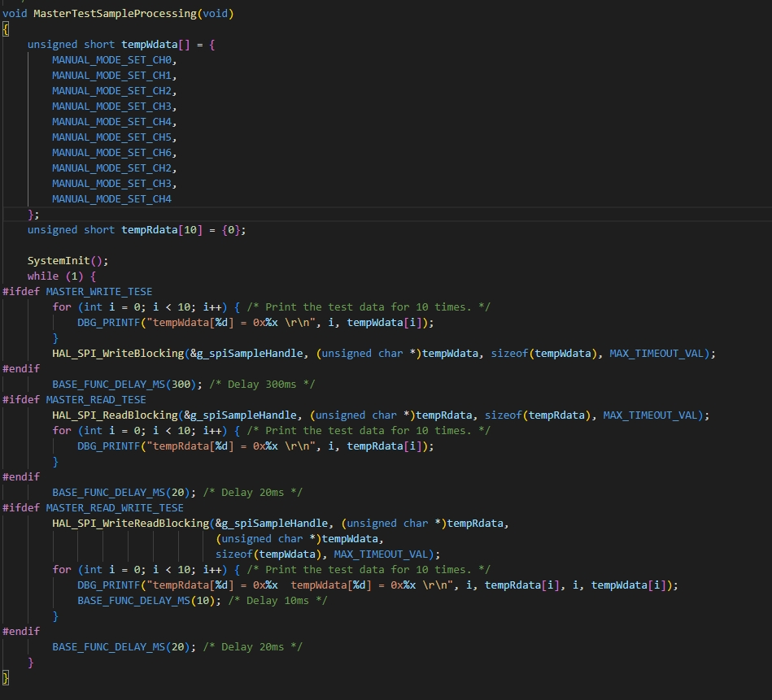 

- 从机：封装例程

   

- 步骤四：如果需要串口打印就需配置以下操作。


- 步骤五：点击.jpg)编译代码，编译完成后，点击烧录代码。

- 步骤六：SPI1_TXD(GPIO4_2)、SPI1_RXD(GPIO4_1)两个接口两个开发板交叉相连，SPI1_CSN1(GPIO4_3)、SPI1_CLK(GPIO4_0)、SPI1_CSN0(GPIO4_5)这三个接口，两开发板对应连接。

   

#### 20.1.5实验结果

主机：

- 烧录成功后，打开串口工具，可以看到串口打印出来了写入UART0的数据，打印主机接收从机的数据“tempRdata[0] = 0x1105....”，打印主机发送的数据 “tempWdata[0] = 0x1001....”，证明实验成功。


​      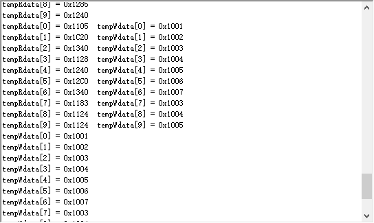 

从机：

- 烧录成功后，打开串口工具，可以看到串口打印出来了写入UART0的数据，打印从机接收主机的数据“tempRdata[0] = 0x1001....”，打印从机发送的数据 “tempWdata[0] = 0x1105....”，证明实验成功。


​      


#### 20.1.6扩展实验

本实验学习配置 SPI使用阻塞方式进行主从通信，请学生做如下实验：

- 配置中断方式进行主从通信。


## 21、正交解码模块（QDM）

### 21.1 单电机双电阻采样的有感Foc应用

#### 21.1.1实验目的

- 基于ECMCU105H/ECBMCU201MPC单板的单电机双电阻采样的有感Foc应用，控制电机转动，并调速。


#### 21.1.2实验要求

- 原理：QDM是正交解码模块用于解码增量编码器，针对增量编码器输出的A/B/Z三相信号进行解码，记录位置信息，方向信息和时间信息。

- 硬件要求：两个3061M核心板加扩展板，24V杰美康电机；

  

  

- 支持API版本、SDK版本：SolarA2 1.0.1.2及以上版本
  
- 支持IDE版本号：HiSpark Studio 1.0.0.8及以上版本
  
  

#### 21.1.3核心函数说明

21.1.3 MCS_QdmInit（）

| 定义：   | void MCS_QdmInit(MCS_QdmInitStru *qdmInit) |
| :------- | ------------------------------------------ |
| 功能：   | QDM初始化                                  |
| 参数：   | qdmInit：MCS_QdmInitStru类型变量           |
| 返回值： | None                                       |
| 依赖：   | msc_inc_enc.c                              |

#### 21.1.4实验流程

- 步骤一：点击配置器选择Pmsm Encode Qdm 2shunt Foc样例，并点击生成代码。

  

- 步骤二：选择要使能驱动模块，在配置界面配置驱动模块。

  

- 步骤三：在配置界面可以修改QDM驱动模块参数配置。

  

  

- 步骤四：点击.jpg)编译代码，编译完成后，点击烧录代码。

- 步骤五：电机黄绿蓝3根线分别接u、v、w接口。

   

- 步骤六：电机编码器五个接口，分别对应接Z、B、A、GND、VCC接口。

    

- 步骤七：点击.jpg)变量跟踪功能来查看elecSpeed速度变量的变化。

   

#### 21.1.5实验结果

- 烧录成功后,电机转动,HiSpark studio软件里的变量跟踪功能检测速度较为平稳。

​     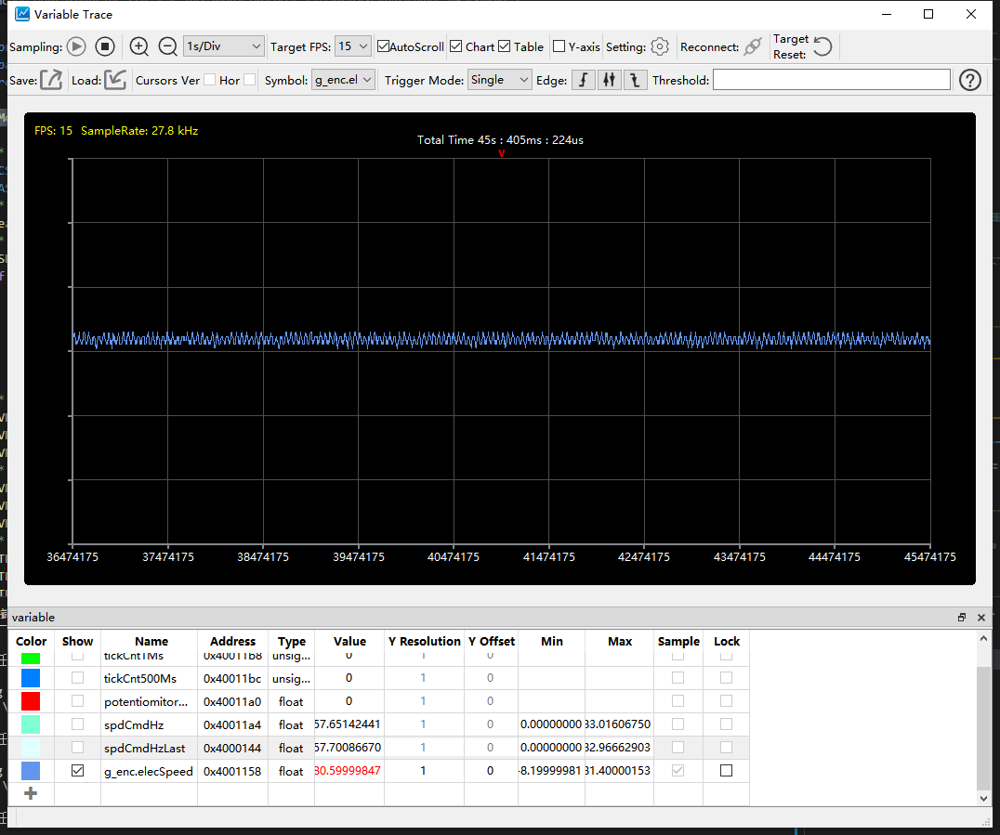

- 可以通过蓝色枢纽旋转调速，可以明显看到电机转动速度变快，然后软件检测的速度变量的变化，证明实验成功。


​        


​                                     

