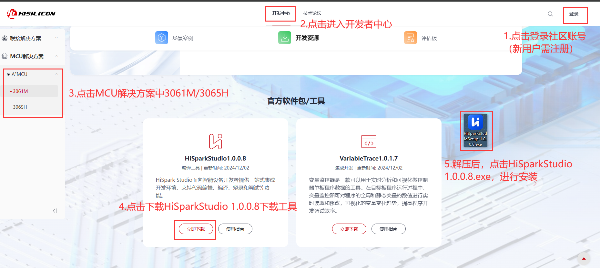

#  Windows IDE环境搭建

在Windows下搭建编译开发环境, 我们推荐Windows 10 64位系统或以上版本：

## 文档介绍

| 文件                                  | 描述                     |
| ------------------------------------- | ------------------------ |
| HiSparkStudio 使用指南 V00B05.pdf     | IDE工具安装以及使用      |
| HiSpark调试器系列 使用指南 V00B03.pdf | 调试器使用               |
| VariableTrace 使用指南 V00B04.pdf     | 实时变量监控工具使用指南 |

## 工具介绍

Hispark Studio IDE 版本下载链接（推荐使用）：<a href="https://hispark-obs.obs.cn-east-3.myhuaweicloud.com/HiSparkStudio.exe" title="超链接title">HisparkStudio</a>

[进入开发者中心](https://developer.hisilicon.com/devCenter/index?id=0c537de0-2aa6-477a-a)，获取Hispark Studio 的步骤如下（建议下载最新版本，以下仅供参考）：

Hispark Studio 独立工具下载链接：<a href="https://hispark-obs.obs.cn-east-3.myhuaweicloud.com/SolarA2IDE.zip" title="超链接title">SolarA2IDE</a>，具体包括如下独立工具：

| 文件名                               | 描述               |
| ------------------------------------ | ------------------ |
| VariableTrace-1.0.1.7.tar.gz         | 实时变量监控工具。 |
| Programmer-1.0.0.1.tar.gz            | 烧录工具。         |
| MotorControlWorkbench-1.0.0.0.tar.gz | 电机工具。         |

Hispark Studio IDE 版本下载链接（历史归档版本）：<a href="https://hispark-obs.obs.cn-east-3.myhuaweicloud.com/HiSparkStudio_beta.zip" title="超链接title">HiSparkStudio_beta</a>

| IDE版本号              | 支持SDK版本号                                     |
| ---------------------- | ------------------------------------------------- |
| HisparkStudio 1.0.0.2  | Solarec 1.0.0.6、SolarA2 1.0.1.2                  |
| HisparkStudio 1.0.0.8  | Solarec 1.0.0.6、SolarA2 1.0.1.2                  |
| HisparkStudio 1.0.0.10 | Solarec 1.0.0.6、SolarA2 1.0.1.2、SolarA2 1.1.0.1 |

## 工具安装及新建工程

1.下载 HisparkStudio IDE及独立工具，并安装。

2.打开 HiSpark Studio IDE，进入欢迎页面，单击“新建工程”，进入新建工程页面。

3.后续弹窗中，根据所使用的开发板，"芯片"选择"3061MNPICA"或"3065HRPIRZ"（根据开发板型号决定，如果是3061M则选择"3061MNPICA"，如果是3065H则选择"3065HRPIRZ"）, 工程名由用户自定义，工程路径选择”用户自定义“，软件包选择工程使用的软件开发驱动包（SDK）文件夹根目录。

4.查看工程创建结果。HiSpark-Studio会自动打开新创建的工程，并进入芯片配置器界面（Chip Config界面），自动生成工程代码。

## 导入工程

1.打开HiSpark Studio，进入到欢迎页面，单击“导入工程”，进入导入工程页面。

2.选择导入的路径，即可查找该路径下所有的工程，勾选需要导入的工程，单击“完成”。

3.导入工程完成后，会在工程区展示出工程的文件夹，并在欢迎界面的工程列表中记录所导入的工程。

## 打开工程

1.打开HiSpark Studio，进入到欢迎页面，单击，进入打开工程页面。

2.选择目标工程打开。

①：选择目标工程所在的路径。
②：选择导入类型为“Project Files（*.hiproj）”。
③：选择目标文件，例如“demo.hiproj”。

④：单击“打开(O)”。

3.工作台视图中展示工程下面的文件夹，且在工程列表中出现当前打开的工程，表示打开工程成功。

4.工程编译，以3061M与3065H在IDE中的操作步骤相同。下列步骤以3065H使用I2C 驱动模块为例：

①：打开工程后，单击工具栏中的“芯片配置器”选项，如下图所示。

②：使能I2C驱动模块，在配置界面配置I2C驱动模块。

③：修改I2C驱动模块参数配置。

④：生成I2C驱动模块代码。

⑤：点击编译按钮，编译成功后终端窗口输出如下图所示。

## 工程烧录

目前支持的烧录调试器有两种：HiSpark-Trace和HiSpark-Link，推荐使用HiSpark-Link。

### HiSpark-Link烧录

- 步骤1：HiSpark-Link需要先安装FTDI驱动，该驱动需要通过zadig.exe转换为WinUSB才可被 Windows操作系统识别，将HiSpark-Link调试器通过USB连接电脑上电（如果是Typec供电，则将跳线帽跳到5V USB，如果是12V供电，则跳线帽跳到5N_IN）。 

  

- 步骤2：下载FTDI官方驱动并安装。 下载地址：FTDI官网。 https://ftdichip.com/drivers/d2xx-drivers/ ，电机官方驱动 “setup executable”即可下载； 解压下载的文件并默认安装即可，安装完成后需要重启计算机。

  

-  步骤3：下载USB驱动程序zadig.exe，无需安装。 下载地址：https://zadig.akeo.ie/。 

- 步骤4： 驱动替换， 操作流程： 1. HiSpark-Link调试器通过USB连接上电。 2. 打开 zadig.exe 应用程序（无需安装）。 3. 单击菜单“Options”->选中“list All Devices”->选中“Dual RS232- HS(Interface 0)”。

  

- 步骤4：单击“Replace Driver”按钮，即可将Dual RS232-HS(Interface 0) 转化为 WinUSB（WinUSB实际版本与zadig.exe驱动版本有关。

  

- 步骤五：耐心等待替换完成，出现提示即替换成功，可通过检查“设备管理器”-> “通用串行总线设备”中出现Dual RS232-HS设备判断驱动替换成功。

  

  

- 步骤六：进入工程配置界面。打开要烧录的工程后，单击顶部的图标，进入工程配置界面->进入程序加载。选择传输方式为“swd”，并配置其他参数。

  

- 步骤七：单击“烧录” 按钮，开始烧录。烧录成功后终端窗口输出如下图所示。

  

### HiSpark-Trace烧录

- 步骤一：将调试器连接主机端，将开发板接上电源线，连接好调试器与开发板。

> HiSpark-Trac烧录：注：HiSpark-Trace调试器有多个连接口，连接错误会导致烧录失败，注意检查。

- 步骤二：进入工程配置界面。打开要烧录的工程后，单击顶部的图标，进入工程配置界面->进入程序加载。选择传输方式为“swd”或者“jtag”并配置其他参数。

- 步骤三：单击“烧录” 按钮，开始烧录。烧录成功后终端窗口输出如下图所示。

