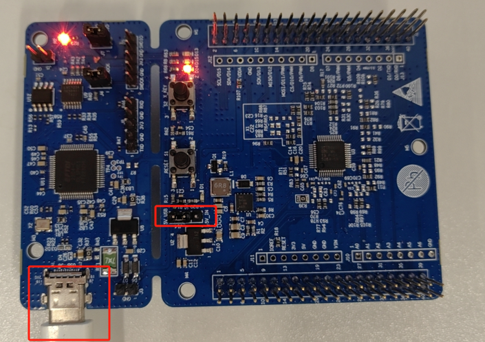
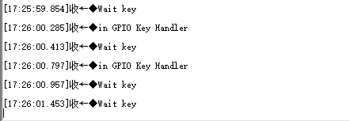
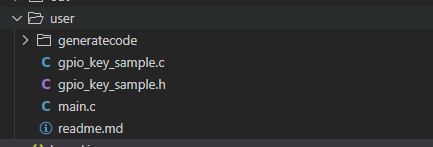
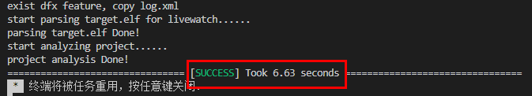
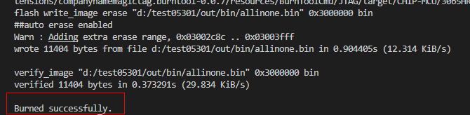

# sample_gpio_key

## 1.1 介绍

**功能介绍：** 基于HAL接口完成时钟、GPIO控制器初始化和功能配置。在示例代码中通过中断的方式实现对S2按键的检测。

**软件概述：** 使用中断方式实现按键功能。

**硬件概述：** 核心板。通过板端丝印可以看出S2按键的GPIO对应GPIO2_4。硬件搭建要求如图所示：

## 1.2 约束与限制

### 1.2.1 支持应用运行的芯片和开发板

  本示例支持开发板：3061M

### 1.2.2 支持API版本、SDK版本

  本示例支持版本号：SolarA2_1.0.1.2

### 1.2.3 支持IDE版本

  本示例支持IDE版本号：1.0.0.6；

## 1.3 效果预览

  当用户烧录编译后的示例代码后，初始化和配置完成后，示例代码中在按键没有按下时Debug串口会一直打印等待按键的log信息，当连接的按键按下时功能正常时Debug串口打印成功log信息；功能异常时按下按键时Debug串口还是会一直打印等待按键的log信息。

## 1.4 接口介绍

#### 1.4.1 HAL_GPIO_Init()

| **定义：**   | void HAL_GPIO_Init(GPIO_Handle *handle)； |
| ------------ | ----------------------------------------- |
| **功能：**   | 初始化GPIO寄存器值                        |
| **参数：**   | handle：GPIO_Handle的值                   |
| **返回值：** | None                                      |
| **依赖：**   | drivers\gpio\common\inc\gpio.h            |

##  1.5 具体实现

  步骤一：GPIO管脚选择：示例代码中选择GPIO管脚用于通过中断方式进行按键检测。也可以选择其他GPIO管脚用于按键检测功能测试，在"GPIO_Init()"接口中的"g_gpiox.baseAddress"可以配置其它GPIOX，g_gpiox.pins可以配置“GPIO_PIN_0-GPIO_PIN_7”中的任意一个。

  步骤二：GPIO管脚初始化：调用接口"HAL_GPIO_Init()”完成对示例代码中GPIO管脚的方向、电平、中断模式配置。

## 1.6 实验流程

- 步骤一：在xxx\vendor\yibaina_3061M\demo\sample_gpio_key/文件夹里面内容复制替换到xxx/user/目录下。

  

- 步骤二：点击编译按钮，编译成功后终端窗口输出如下图所示。
  

  

- 步骤三：进入工程配置界面。打开要烧录的工程后，单击顶部的图标，进入工程配置界面->进入程序加载。选择传输方式为“swd”，并配置其他参数。（具体[参考tools目录README搭建环境](https://gitee.com/HiSpark/open_mcu/tree/master/tools))

  

- 步骤四：单击“烧录” 按钮，开始烧录。烧录成功后终端窗口输出如下图所示。

  

* 步骤五 ： 当用户烧录编译后的示例代码后，初始化和配置完成后，示例代码中在按键没有按下时Debug串口会一直打印等待按键的log信息，当连接的按键按下时功能正常时Debug串口打印成功log信息；功能异常时按下按键时Debug串口还是会一直打印等待按键的log信息。

  

  

  